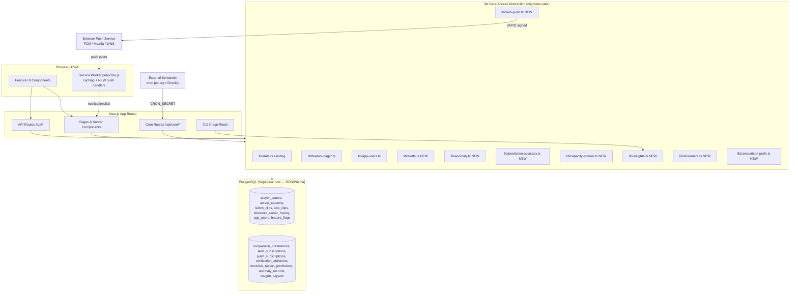
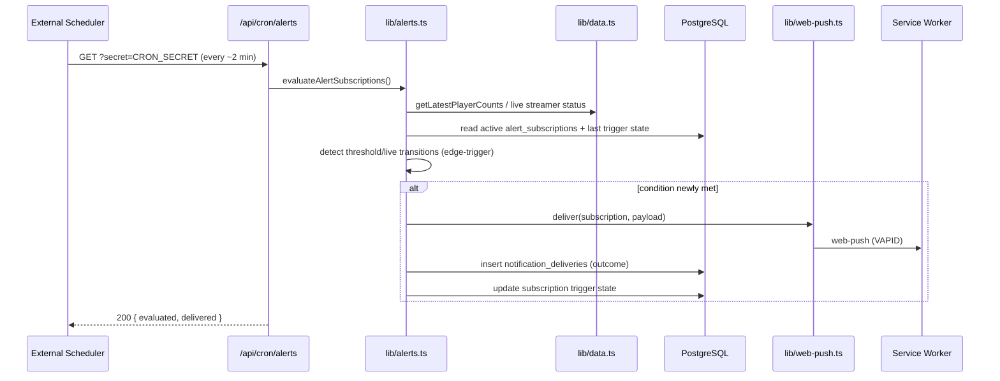
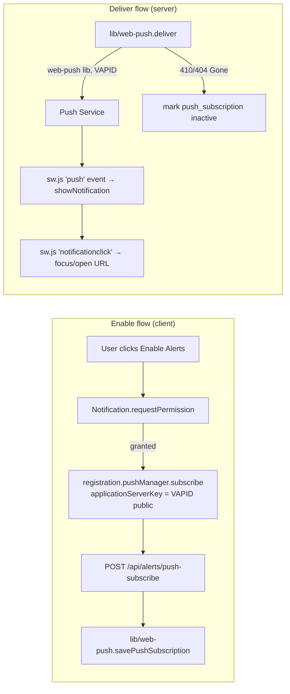
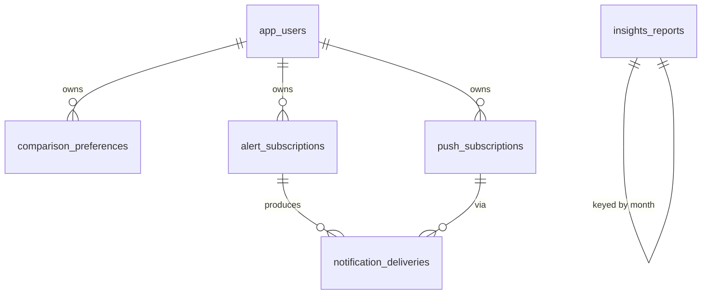

# Design Document

## Overview

This design covers a batch of seven feature enhancements for RPStats.com plus two cross-cutting concerns (feature-flag gating and data-layer/migration compatibility). The features extend the existing real-time GTA RP analytics platform with comparison, personalization, notification, and analytics capabilities, all driven primarily from the existing `player_counts` time-series and related data.

The platform is a Next.js (App Router) + TypeScript application backed by PostgreSQL, currently served through Supabase and undergoing an in-flight migration to AWS RDS + Prisma. Every design decision below is constrained by that migration: **all new database access routes through shared functions in `lib/`**, and **every new table is specified in client-agnostic terms** (columns, types, indexes, ownership) so it can be expressed in both Supabase SQL and a Prisma schema with no logic change.

### Phased Rollout

| Phase | Features | Requirements |
|-------|----------|--------------|
| **P1** | Server Comparison View, Restart Prediction Accuracy Tracking, Capacity/Queue Insights | R2, R6, R8 |
| **P2** | User Alerts & Notifications, Anomaly Detection | R3, R7 |
| **P3** | Streamer-Centric Pages, Historical Wrapped/Insights | R4, R5 |
| **Cross-cutting** | Feature Flag Gating, Data Layer/Migration Compatibility | R1, R9 |

Each feature ships behind its own flag (R1), so phases can be enabled independently and rolled back without redeploy.

### Key Design Decisions

1. **Scheduling via cron-triggered Next.js routes.** Alert evaluation (R3) and monthly report generation (R5) follow the established `/api/cron/*` + `CRON_SECRET` pattern already used by `/api/cron/monitoring`. This avoids coupling feature logic to the Supabase Edge Function ingestion pipeline (which is itself being migrated) and keeps all logic in `lib/` modules that are client-agnostic. Rationale: the ingestion path is the most migration-sensitive part of the system; layering alert/report logic on top of an external scheduler that simply hits a Next.js route keeps the new code in the application tier where the `lib/` abstraction already insulates us from the Supabase→Prisma swap.

2. **Social-share images via on-demand OG image generation.** Insights Report share images (R5.5) are rendered on demand by a Next.js route using `ImageResponse` (the App Router `next/og` / `@vercel/og` primitive), reading the persisted report through a `lib/` function and emitting a PNG with cache headers. Rationale: no extra asset storage to manage during the migration, and it composes with App Router metadata (`generateMetadata`) for Open Graph / Twitter card tags.

3. **All new reads reuse existing `lib/data.ts` functions** (`getPlayerCounts`, `getServerCapacities`, `getStreamCounts`, etc.) wherever they already provide the required data, rather than opening parallel query paths (R9.3). New persistence (preferences, subscriptions, anomalies, predictions, reports) is added as new `lib/` modules that mirror the existing data-access conventions.

4. **Per-user data is owned and scoped** by `app_users.id`, following the existing `user_favorites` pattern: a foreign key to `app_users(id) ON DELETE CASCADE`, row-level security in Supabase, and an equivalent ownership check enforced in the `lib/` layer so the guarantee survives the move to Prisma/RDS (R9.4).

## Architecture

### System Context



### Layering Rules (R9.1, R9.3)

- Pages and components **never** import a Supabase/Prisma client directly. They call functions exported from `lib/`.
- Each new `lib/` module exposes typed read/write functions and internally selects the client exactly as `lib/data.ts` does today (`typeof window !== "undefined" ? supabase : createServerClient()`), or the service-role client for privileged background work.
- When a feature needs existing time-series data it imports the existing `lib/data.ts` function. No feature introduces a second query path against `player_counts`, `server_capacity`, `streamer_count`, or clips tables.

### Background Processing Model (R3.5, R3.6, R5.1, R7.1)



The same external-scheduler approach drives:
- `/api/cron/alerts` — evaluate alert subscriptions (R3.5–R3.7, R3.10).
- `/api/cron/anomaly` — evaluate the newest player-count points for anomalies (R7.1–R7.3, R7.6). May alternatively be folded into the existing monitoring run; the detection logic lives in `lib/anomaly.ts` either way.
- `/api/cron/insights` — daily check that generates the previous month's Insights_Report once a calendar month completes (R5.1, R5.6).
- `/api/cron/record-predictions` — snapshot current Restart_Predictor output into `recorded_restart_predictions` (R6.1) and match detected restarts against recorded predictions (R6.2).

Each route is guarded by `CRON_SECRET` exactly like the existing `/api/cron/monitoring` route, and each delegates all real work to a `lib/` function so the logic is unit/property testable without HTTP.

### Web-Push Architecture (R3.4, R3.9)

The existing `public/sw.js` only does caching. This design **adds** (does not replace) push capability:



New service-worker handlers appended to `public/sw.js`:
- `self.addEventListener('push', ...)` — parse JSON payload, call `showNotification(title, { body, icon, data })`.
- `self.addEventListener('notificationclick', ...)` — focus an existing client or open the deep link in `notification.data.url`.

New env/config: `VAPID_PUBLIC_KEY`, `VAPID_PRIVATE_KEY`, `VAPID_SUBJECT`. The public key is exposed to the client (it is non-secret by design); the private key stays server-side.

## Components and Interfaces

### Cross-Cutting: Feature Flag Gating (R1)

Reuses `lib/feature-flags.ts` (client context, 30s refresh) and `lib/feature-flags-server.ts` (server check). New flag keys are added to the `FEATURE_FLAGS` constant and registered in the DB via a SQL seed following `add_favorites_feature_flag.sql`.

| Flag key | Gates |
|----------|-------|
| `comparison_view` | R2 Comparison View |
| `alerts` | R3 Alert System |
| `streamer_pages` | R4 Streamer Profiles |
| `insights_wrapped` | R5 Insights Reports |
| `prediction_accuracy` | R6 Accuracy Tracker |
| `anomaly_public` | R7.5 public anomaly surfacing |
| `capacity_advisor` | R8 Capacity Advisor |

- Client surfaces gate with `useFeatureFlag(key)`; navigation entries and routes hide when disabled (R1.2).
- Server-rendered pages call `isFeatureFlagEnabled(key)` and return `notFound()` when disabled, so a disabled feature is unreachable even by direct URL.
- The client context already refreshes every 30s (R1.3) and defaults a missing/unretrievable flag appropriately. **Design refinement for R1.4:** for App_User-facing surfaces a flag that cannot be retrieved must be treated as **disabled** (fail-closed). The existing client provider currently fails *open* on fetch error; this design overrides per-feature gating to fail closed for these seven flags by treating `undefined`/error as `false` at the gating call site, and `isFeatureFlagEnabled` already returns `false` on error.

**Interface (`lib/feature-flags.ts` additions):** new keys on `FEATURE_FLAGS`; no signature changes.

### Phase 1

#### Server Comparison View (R2)

**Page:** `app/compare/page.tsx` (client component, gated by `comparison_view`).

**Components:**
- `ComparisonView` — orchestrates pinned-server state, time range, chart, and stat cards.
- `ServerPinSelector` — add/remove servers; enforces the 2–4 bound (R2.2, R2.3).
- `ComparisonChart` — overlaid multi-series player-count chart, one series per pinned server, reusing the existing charting stack and `getServerColors()` for consistent colors (R2.1, R2.8).
- `ComparisonStatCard` — per-server current/peak/peak-time/next-restart summary (R2.4, R2.5).

**Data access (`lib/comparison-prefs.ts`, `lib/data.ts` reuse):**
```ts
// Reuses existing time-series reads (R9.3)
getPlayerCounts(serverIds, timeRange)            // existing
getServerColors()                                 // existing
getRestartPredictions(serverIds)                  // existing API/lib (R2.5)

// New per-user persistence of pinned set (optional convenience)
getComparisonPreferences(userId): Promise<PinnedSet | null>
saveComparisonPreferences(userId, serverIds: string[]): Promise<void>  // validates 2..4
```
- Pure helpers (testable): `validatePinnedSelection(serverIds)` enforces max 4 and reports when < 2; `computeServerSummary(series, serverId)` returns `{ current, peak, peakTime }`; `assignSeriesColors(serverIds, colorMap)` produces a stable, distinct color per server.
- Pinned set persists per authenticated user when signed in; anonymous users keep it in URL/local state. Persisted rows are owned per user (R9.4).

#### Restart Prediction Accuracy Tracking (R6)

`lib/restart-prediction.ts` computes predictions on demand and does **not** persist them. R6 requires a recording mechanism.

**New module `lib/prediction-accuracy.ts`:**
```ts
recordPrediction(p: { serverId; predictedRestartTime; confidence; predictionMadeAt }): Promise<void>  // R6.1
matchRestartToprediction(serverId, observedRestartTime): Promise<MatchResult | null>                  // R6.2
computeRollingAccuracy(window = '7d', toleranceMinutes): Promise<AccuracyMetric | null>                // R6.3, R6.6
getDisplayAccuracy(): Promise<AccuracyDisplay>  // returns "not yet available" when no records (R6.6)
```
- `/api/cron/record-predictions` calls `recordPrediction` for each server's current prediction (snapshot), then runs restart detection (reusing `detectRestartEvents` from `lib/restart-prediction.ts`) and calls `matchRestartToprediction` for newly observed restarts, storing the signed difference in minutes.
- The predictions tab UI adds the rolling 7-day accuracy metric (R6.4) and a confidence level/interval next to each predicted time (R6.5), using the existing `formatConfidence` / `getConfidenceLevel` helpers.
- Pure helpers: `accuracyWithinTolerance(diffMinutes, tolerance)`, `rollingAccuracy(records, now, window, tolerance)`.

#### Capacity and Queue Insights (R8)

**New module `lib/capacity-advisor.ts`:**
```ts
computeJoinWindow(input: {
  playerSeries: PlayerCountData[];      // from getPlayerCounts (R9.3)
  capacitySeries: ServerCapacityData[]; // from getServerCapacities (R9.3)
  queueSeries?: QueueHistoryPoint[];    // optional, when server has queue support (R8.3)
  analysisWindowDays: number;           // >= 7 (R8.2)
}): JoinRecommendation | { available: false }   // R8.5

formatRecommendationLocal(rec, ianaTimeZone): LocalizedRecommendation  // R8.4
isCurrentlyFull(latestPlayers, latestCapacity, nearThreshold): boolean // R8.6
```
- Reuses `getServerCapacities` and `getPlayerCounts`; reuses `hasQueueSupport`/`getQueueConfig` from `lib/server-queues.ts` to decide whether queue data participates (R8.3).
- Recommendation algorithm: bucket the rolling window by hour-of-week, compute mean occupancy ratio (`players / max_capacity`) per bucket, optionally penalize by mean queue length, and select the contiguous low-occupancy window. Returned in UTC; the component localizes to the viewer's `Intl` time zone (R8.4).
- Queue history requires persistence (queue data is fetched live today). New `lib/server-queues` reads draw from a `queue_history` capture, but to stay in scope this design treats queue history as the existing live `QueueServerData` sampled into the time-series only where already collected; the advisor degrades gracefully to capacity+player-count when no queue history exists.

### Phase 2

#### User Alerts and Notifications (R3)

**Pages/Components:**
- `app/alerts/page.tsx` (gated by `alerts`, requires auth) — list/create/edit/delete subscriptions (R3.1, R3.2, R3.8); "Enable web-push" control (R3.4).
- `AlertSubscriptionForm`, `AlertSubscriptionList`, `EnablePushButton`.

**API routes (thin; delegate to lib):**
```
POST   /api/alerts/subscriptions        create (auth required → R3.3)
GET    /api/alerts/subscriptions        list own (R3.8)
PATCH  /api/alerts/subscriptions/[id]   edit own (R3.8)
DELETE /api/alerts/subscriptions/[id]   delete own (R3.8)
POST   /api/alerts/push-subscribe       store Push_Subscription (R3.4)
GET    /api/cron/alerts                 scheduled evaluation (CRON_SECRET)
```

**`lib/alerts.ts`:**
```ts
createSubscription(userId, sub: NewAlertSubscription): Promise<AlertSubscription>  // R3.1, R3.2
listSubscriptions(userId): Promise<AlertSubscription[]>                            // R3.8
updateSubscription(userId, id, patch): Promise<AlertSubscription>                  // R3.8 own-only
deleteSubscription(userId, id): Promise<void>                                      // R3.8 own-only
evaluateAlertSubscriptions(now): Promise<EvaluationSummary>                        // R3.5–R3.7, R3.10
```
- **Edge-triggered evaluation (R3.7):** each subscription carries a `last_condition_state` ('met' | 'cleared'). A notification fires only on a `cleared → met` transition; while it stays `met`, no repeat fires; it re-arms when the condition clears. Threshold-below uses the latest vs previous player count (transition from `>= threshold` to `< threshold`, R3.5). Streamer-live uses offline→live transition (R3.6).
- **Authorization:** `createSubscription` requires a resolved `app_users.id`; the API route returns 401 for unauthenticated callers (R3.3). All read/update/delete operations filter by `userId` (R9.4).

**`lib/web-push.ts`:**
```ts
savePushSubscription(userId, sub: PushSubscriptionJSON): Promise<void>     // R3.4
deliver(pushSub, payload): Promise<DeliveryOutcome>                        // signs with VAPID
markInactiveIfGone(pushSubId, httpStatus): Promise<void>                  // R3.9 (404/410)
recordDelivery(d: DeliveryRecord): Promise<void>                          // R3.10
```
- Uses the `web-push` npm library (do not hand-roll VAPID). On 404/410 from the push service, mark the `push_subscriptions` row inactive and skip it thereafter (R3.9). Every delivery attempt writes a `notification_deliveries` row with timestamp, subscription id, and outcome (R3.10).

#### Anomaly Detection (R7)

**`lib/anomaly.ts`:**
```ts
classifyPoint(input: {
  observed: number; expected: number; thresholdPercent: number; minChange: number;
}): { anomalous: boolean; direction: 'spike' | 'drop' | null }            // R7.1
expectedValueFor(series, timestamp): number                               // baseline (hour-of-week mean)
recordAnomaly(rec: AnomalyRecord): Promise<{ recorded: boolean }>          // R7.2, R7.3, R7.6 dedup
getAnomaliesForServer(serverId, opts): Promise<AnomalyRecord[]>            // R7.4, R7.5
loadAnomalyConfig(): Promise<AnomalyConfig>                                // R7.7
saveAnomalyConfig(cfg): Promise<void>                                     // R7.7 (admin)
```
- Reuses the existing `lib/monitoring.ts` anomaly approach (percent deviation + minimum absolute change) but persists records to a dedicated `anomaly_records` table with expected/observed/direction (R7.2, R7.3). Admin monitoring page (`app/admin/monitoring/page.tsx`) surfaces them (R7.4).
- **Dedup (R7.6):** `recordAnomaly` suppresses a new record when an active anomaly for the same `(server_id, direction)` exists within the configured window — mirrors `processAlerts` dedup against `alert_history`.
- Thresholds are admin-configurable via `system_settings` (`lib/system-settings.ts`), defaulting to the existing monitoring config values (R7.7).
- Public surfacing on a server's page is gated by `anomaly_public` (R7.5).

### Phase 3

#### Streamer-Centric Pages (R4)

**Page:** `app/streamers/[platform]/[username]/page.tsx` (gated by `streamer_pages`).

**`lib/streamers.ts`:**
```ts
getStreamerProfile(platform, username): Promise<StreamerProfile | null>   // R4.1, R4.6
getStreamerServers(username): Promise<ServerData[]>                       // R4.2 from streamer_server_history
getStreamerClips(username, platform): Promise<Clip[]>                     // R4.3 reuse clips data
getStreamerLiveStatus(platform, username): Promise<LiveStatus>            // R4.1, R4.4, R4.7
getStreamerViewerTrend(username, timeRange): Promise<ViewerCountData[]>   // R4.5 reuse getViewerCounts
linkPlatformIdentities(username): Promise<PlatformIdentity[]>             // R4.7 twitch + kick
```
- Reuses `streamer_server_history` (R4.2), `twitch_clips`/`kick_clips` (R4.3), existing Twitch/Kick live integrations (`lib/kick-api.ts`, Twitch ingest) for live status and viewer counts (R4.1, R4.4, R4.5), and `getViewerCounts` from `lib/data.ts` for the trend.
- Empty-state: when no history exists for the requested streamer, render a "no data available" message (R4.6).
- A streamer present on both Twitch and Kick shows both identities with per-platform live status (R4.7).

#### Historical Wrapped and Insights (R5)

**Pages/Routes:**
- `app/wrapped/page.tsx` — list of retained monthly reports (R5.6), gated by `insights_wrapped`.
- `app/wrapped/[month]/page.tsx` — single report; `generateMetadata` emits OG/Twitter tags pointing at the share image (R5.4).
- `app/wrapped/[month]/opengraph-image.tsx` — on-demand `ImageResponse` social preview (R5.5).
- `GET /api/cron/insights` — month-rollover generation (R5.1).

**`lib/insights.ts`:**
```ts
generateMonthlyReport(month: YYYYMM): Promise<InsightsReport>             // R5.1, R5.2, R5.3
getReport(month): Promise<InsightsReport | null>                         // R5.4, R5.6
listReports(): Promise<InsightsReportSummary[]>                          // R5.6
computeMetrics(series, month): InsightsMetrics                           // pure, R5.2, R5.3
```
- Reads the month's data via existing `getPlayerCounts` (R9.3). `computeMetrics` derives peak-activity day, busiest server, and largest month-over-month growth (R5.2). When data is insufficient for a metric, the metric is emitted as `{ available: false }` and the UI labels it "unavailable" rather than showing a wrong value (R5.3).
- Reports persist in `insights_reports` keyed by month and are immutable once generated and retained (R5.6). The share link renders the same stored report for any visitor (R5.4).

## Data Models

All new tables use a `BIGINT GENERATED BY DEFAULT AS IDENTITY` primary key, `TIMESTAMP WITH TIME ZONE` for times, explicit indexes, and (for per-user tables) a `user_id BIGINT REFERENCES app_users(id) ON DELETE CASCADE` with RLS — matching the existing `user_favorites` convention so each is expressible in both Supabase SQL and Prisma (R9.2). Per-user tables enforce owner-only access in both RLS and the `lib/` layer (R9.4).

### comparison_preferences (R2)
Per-user pinned-server set for the Comparison View.

| Column | Type | Notes |
|--------|------|-------|
| id | bigint identity PK | |
| user_id | bigint FK → app_users(id) cascade | owner (R9.4) |
| pinned_server_ids | text[] | 2–4 server ids, validated in lib |
| time_range | text | last selected range |
| created_at | timestamptz default now() | |
| updated_at | timestamptz default now() | |

Indexes: unique(`user_id`); index(`user_id`). RLS: owner-only select/insert/update/delete.

### alert_subscriptions (R3)
User-defined alert rules.

| Column | Type | Notes |
|--------|------|-------|
| id | bigint identity PK | |
| user_id | bigint FK → app_users(id) cascade | owner (R9.4) |
| type | text CHECK in ('player_count_below','streamer_live') | R3.1, R3.2 |
| server_id | text NULL | for player_count_below |
| threshold | integer NULL | for player_count_below |
| streamer_username | text NULL | for streamer_live |
| streamer_platform | text NULL CHECK in ('twitch','kick') | |
| is_enabled | boolean default true | |
| last_condition_state | text default 'cleared' CHECK in ('met','cleared') | edge-trigger (R3.7) |
| last_triggered_at | timestamptz NULL | |
| created_at | timestamptz default now() | |
| updated_at | timestamptz default now() | |

Indexes: index(`user_id`); index(`type, is_enabled`); index(`server_id`) WHERE type='player_count_below'; index(`streamer_username, streamer_platform`) WHERE type='streamer_live'. RLS: owner-only.

### push_subscriptions (R3.4, R3.9)
Browser web-push endpoints per user.

| Column | Type | Notes |
|--------|------|-------|
| id | bigint identity PK | |
| user_id | bigint FK → app_users(id) cascade | owner (R9.4) |
| endpoint | text NOT NULL | push service URL |
| p256dh | text NOT NULL | client public key |
| auth | text NOT NULL | auth secret |
| is_active | boolean default true | set false on 404/410 (R3.9) |
| user_agent | text NULL | |
| created_at | timestamptz default now() | |
| last_used_at | timestamptz NULL | |

Indexes: unique(`endpoint`); index(`user_id`); index(`is_active`) WHERE is_active = true. RLS: owner-only (service role for delivery).

### notification_deliveries (R3.10)
Delivery log.

| Column | Type | Notes |
|--------|------|-------|
| id | bigint identity PK | |
| subscription_id | bigint FK → alert_subscriptions(id) cascade | R3.10 |
| push_subscription_id | bigint FK → push_subscriptions(id) NULL | |
| delivered_at | timestamptz default now() | R3.10 timestamp |
| outcome | text CHECK in ('delivered','failed','expired') | R3.10 outcome |
| detail | jsonb NULL | error/status payload |

Indexes: index(`subscription_id, delivered_at desc`); index(`delivered_at desc`).

### recorded_restart_predictions (R6.1, R6.2)
Snapshots of predictions for accuracy tracking. `lib/restart-prediction.ts` does not persist; this table is the new data dependency.

| Column | Type | Notes |
|--------|------|-------|
| id | bigint identity PK | |
| server_id | text NOT NULL | |
| predicted_restart_time | timestamptz NOT NULL | R6.1 |
| confidence | integer NOT NULL | R6.1 |
| prediction_made_at | timestamptz NOT NULL default now() | R6.1 |
| observed_restart_time | timestamptz NULL | filled on match (R6.2) |
| difference_minutes | integer NULL | signed diff (R6.2) |
| matched_at | timestamptz NULL | |

Indexes: index(`server_id, prediction_made_at desc`); index(`prediction_made_at desc`); index(`server_id, observed_restart_time`). Read-only to clients; service role writes.

### anomaly_records (R7.2, R7.3, R7.6)
Persisted anomalies.

| Column | Type | Notes |
|--------|------|-------|
| id | bigint identity PK | |
| server_id | text NOT NULL | R7.2/3 |
| timestamp | timestamptz NOT NULL | observation time |
| observed_value | integer NOT NULL | R7.2/3 |
| expected_value | integer NOT NULL | R7.2/3 |
| direction | text CHECK in ('spike','drop') | R7.2/3 |
| deviation_percent | integer NOT NULL | |
| is_active | boolean default true | for dedup window (R7.6) |
| created_at | timestamptz default now() | |

Indexes: index(`server_id, direction, created_at desc`); index(`created_at desc`); index(`server_id, is_active`) WHERE is_active = true. Read for admin always; public reads gated by `anomaly_public`.

### insights_reports (R5)
Retained monthly reports.

| Column | Type | Notes |
|--------|------|-------|
| id | bigint identity PK | |
| month | text NOT NULL UNIQUE | 'YYYY-MM' (R5.1, R5.6) |
| metrics | jsonb NOT NULL | peak day, busiest server, MoM growth; per-metric availability (R5.2, R5.3) |
| generated_at | timestamptz default now() | |
| share_slug | text NOT NULL UNIQUE | public share link (R5.4) |

Indexes: unique(`month`); unique(`share_slug`); index(`generated_at desc`). Public read by slug; service role writes.

### queue_history (R8.3, optional)
Only if queue length is sampled into history. Same shape conventions: `id`, `server_id text`, `timestamp timestamptz`, `total_players int`, `queue_length int`, index(`server_id, timestamp desc`). The advisor degrades gracefully when absent.

### Entity Relationships



## Correctness Properties

*A property is a characteristic or behavior that should hold true across all valid executions of a system — essentially, a formal statement about what the system should do. Properties serve as the bridge between human-readable specifications and machine-verifiable correctness guarantees.*

The following properties are derived from the acceptance-criteria prework. Redundant criteria were consolidated: subscription-create for both types is one property; anomaly record-shape covers both directions; alert edge-trigger covers R3.5/R3.6/R3.7; report persistence covers R5.4/R5.6; pinned-selection validation covers R2.2/R2.3; capacity recommendation covers R8.1/R8.2; and cross-user ownership (R9.4) subsumes the R3.8 own-only aspect.

### Property 1: Disabled flags hide gated surfaces

*For any* feature flag key and any flag state map, the gating decision for an App_User-facing surface is `true` only when that feature's flag is explicitly enabled; for every key whose flag is disabled, the surface is hidden.

**Validates: Requirements 1.2**

### Property 2: Unretrievable flags fail closed

*For any* flag key whose value is missing, `undefined`, or produced by an error, the App_User-facing gating decision is `false` (feature treated as disabled).

**Validates: Requirements 1.4**

### Property 3: Pinned-selection bounds

*For any* candidate selection of servers, `validatePinnedSelection` accepts the selection only when its size is between 2 and 4 inclusive; a selection larger than 4 is rejected with a "4-server maximum" signal and a selection smaller than 2 yields the "pin at least 2" prompt state.

**Validates: Requirements 2.2, 2.3**

### Property 4: One chart series per pinned server

*For any* valid pinned set (size 2–4) and its player-count data, the constructed chart model contains exactly one series per pinned server and no series for any non-pinned server.

**Validates: Requirements 2.1**

### Property 5: Per-server summary statistics are correct

*For any* player-count series for a server, `computeServerSummary` returns `current` equal to the latest point's value, `peak` equal to the maximum value over the selected range, and `peakTime` equal to the timestamp of that maximum.

**Validates: Requirements 2.4**

### Property 6: Time-range change preserves the pinned set

*For any* pinned set and any two time ranges, recomputing the comparison for the second range keeps the same pinned set membership and produces charts/stats derived solely from the second range's data.

**Validates: Requirements 2.6**

### Property 7: Removing a pinned server retains the rest

*For any* pinned set and any member removed from it, the resulting set excludes the removed server and equals the original set minus that server (all other series and stats retained).

**Validates: Requirements 2.7**

### Property 8: Series colors are distinct and consistent

*For any* pinned set, `assignSeriesColors` assigns a distinct color to each server, and the color mapped to a given server in the chart equals the color mapped to that same server in the summary statistics.

**Validates: Requirements 2.8**

### Property 9: Subscription create round trip

*For any* authenticated user and any valid subscription input — either "player count below threshold" (server id + integer threshold) or "streamer live" (target streamer) — creating the subscription and then reading the user's subscriptions returns a subscription of that type carrying the same field values.

**Validates: Requirements 3.1, 3.2**

### Property 10: Subscription creation requires authentication

*For any* create-subscription attempt with no resolved `app_users` identity, the operation is denied (no subscription is persisted) and signals an authentication-required outcome.

**Validates: Requirements 3.3**

### Property 11: Push subscription storage round trip

*For any* granted browser push subscription and any user, `savePushSubscription` stores it associated with that user such that reading the user's active push subscriptions returns an entry with the same endpoint and keys.

**Validates: Requirements 3.4**

### Property 12: Alert delivery is edge-triggered exactly once per trigger

*For any* alert subscription and any sequence of observed states, a notification is delivered exactly on each transition into the "met" condition (player count crossing from at-or-above the threshold to below it, or a streamer going offline→live), and no further notification is delivered while the condition remains met until it clears and re-triggers.

**Validates: Requirements 3.5, 3.6, 3.7**

### Property 13: Failed-as-gone push subscriptions are deactivated and skipped

*For any* delivery attempt that returns an expired/invalid status (HTTP 404 or 410), the corresponding push subscription is marked inactive, and subsequent delivery selection excludes inactive subscriptions.

**Validates: Requirements 3.9**

### Property 14: Every delivery is logged

*For any* notification delivery attempt, a delivery record is written containing a timestamp, the associated subscription id, and the delivery outcome.

**Validates: Requirements 3.10**

### Property 15: Streamer servers derive from history

*For any* streamer, `getStreamerServers` returns exactly the set of distinct servers recorded for that streamer in `streamer_server_history` (no extras, no omissions).

**Validates: Requirements 4.2**

### Property 16: Streamer clips derive from clips data

*For any* streamer, `getStreamerClips` returns exactly the clips attributed to that streamer in the clips data and excludes clips of any other streamer.

**Validates: Requirements 4.3**

### Property 17: Viewer trend is scoped to streamer and range

*For any* streamer and any selected time range, every point in the returned viewer trend belongs to that streamer and falls within the selected range.

**Validates: Requirements 4.5**

### Property 18: Dual-platform identities are both surfaced

*For any* streamer associated with both a Twitch and a Kick identity, `linkPlatformIdentities` returns both identities, each with its own live status.

**Validates: Requirements 4.7**

### Property 19: Insights metrics are computed correctly

*For any* month of player-count series with sufficient data, `computeMetrics` returns the peak-activity day equal to the day with the maximum aggregate activity, the busiest server equal to the server with the maximum monthly total, and the largest-growth server equal to the server with the maximum month-over-month increase.

**Validates: Requirements 5.2**

### Property 20: Insufficient data yields an unavailable label, never a wrong value

*For any* month whose series lacks the data needed for a given metric, `computeMetrics` marks that metric unavailable rather than emitting a fabricated or zero value.

**Validates: Requirements 5.3**

### Property 21: Generated reports are retained and retrievable unchanged

*For any* set of generated monthly reports, each previously generated report remains retrievable (by month and by share slug) with identical content after later reports are generated; resolving a report's share slug returns the same report for any caller.

**Validates: Requirements 5.4, 5.6**

### Property 22: Prediction recording round trip

*For any* restart prediction, `recordPrediction` persists the predicted restart time, confidence, and time-the-prediction-was-made such that reading it back returns the same three values.

**Validates: Requirements 6.1**

### Property 23: Restart matching selects the most recent applicable prediction

*For any* observed restart for a server and any set of recorded predictions, the match is the most recent recorded prediction applicable to that restart, and the stored difference equals the signed minutes between predicted and observed times.

**Validates: Requirements 6.2**

### Property 24: Rolling accuracy is the within-tolerance proportion

*For any* set of recorded predictions, a window, and a tolerance, `rollingAccuracy` equals the count of in-window predictions whose observed restart fell within tolerance divided by the count of in-window predictions with an observed restart.

**Validates: Requirements 6.3**

### Property 25: No in-window records yields "not yet available"

*For any* prediction set with no matched records inside the rolling window, `getDisplayAccuracy` returns the "not yet available" state rather than `0` or any numeric proportion.

**Validates: Requirements 6.6**

### Property 26: Anomaly classification respects threshold and minimum change

*For any* observed value, expected value, deviation threshold, and minimum absolute change, `classifyPoint` flags the point anomalous exactly when the percent deviation from expected exceeds the threshold and the absolute change exceeds the minimum change; the reported direction is "spike" when observed exceeds expected and "drop" otherwise.

**Validates: Requirements 7.1**

### Property 27: Recorded anomalies contain all required fields

*For any* classified anomaly in either direction, the recorded anomaly contains the server identifier, the timestamp, the observed value, the expected value, and the matching direction ("spike" or "drop").

**Validates: Requirements 7.2, 7.3**

### Property 28: Anomaly recording is deduplicated within the window

*For any* anomaly whose server and direction already have an active record within the configured deduplication window, recording the same server+direction does not create a new record.

**Validates: Requirements 7.6**

### Property 29: Anomaly threshold config round trip and application

*For any* threshold configuration saved by an admin, `loadAnomalyConfig` returns the saved values, and classification performed afterward uses those values.

**Validates: Requirements 7.7**

### Property 30: Capacity recommendation derives from the analysis window

*For any* server with sufficient capacity and player-count history, `computeJoinWindow` returns a recommendation computed only from data within the rolling analysis window (at least 7 days) and selects a low-occupancy window relative to maximum capacity.

**Validates: Requirements 8.1, 8.2**

### Property 31: Queue data biases recommendations away from high-queue times

*For any* inputs, incorporating historical queue length never moves the recommended window toward higher-queue buckets compared with the queue-free recommendation (queue length acts as a monotonic penalty).

**Validates: Requirements 8.3**

### Property 32: Local-time conversion round trip

*For any* UTC recommendation window and any IANA time zone, converting the window to that zone and back to UTC yields the original instant (the localized presentation denotes the same moment in time).

**Validates: Requirements 8.4**

### Property 33: Insufficient capacity data yields "not yet available"

*For any* server whose history falls below the data threshold, `computeJoinWindow` returns the "recommendation not yet available" state rather than a fabricated window.

**Validates: Requirements 8.5**

### Property 34: Near-full detection accompanies the recommendation

*For any* latest (player count, capacity) pair at or above the near-full threshold, `isCurrentlyFull` is true and the produced recommendation includes the currently-full/near-full indicator alongside the window.

**Validates: Requirements 8.6**

### Property 35: Per-user rows are owner-scoped

*For any* two distinct users and any per-user table (comparison_preferences, alert_subscriptions, push_subscriptions), a user can read and modify only their own rows; an attempt by one user to read or modify another user's row is denied and changes nothing.

**Validates: Requirements 3.8, 9.4**

## Error Handling

### Feature flags (R1.4)
- Server gating (`isFeatureFlagEnabled`) already returns `false` on any error. Client gating for these seven flags treats `undefined`/error as `false` (fail-closed) so a feature is never exposed when its flag state is unknown. Disabled server-rendered routes return `notFound()`.

### Data access / migration safety (R9)
- All new `lib/` functions return typed results and handle the absence of a table or a query error by logging and returning a safe empty value (mirroring `lib/data.ts`, e.g. `getServers` falling back when `server_xref` is missing). This keeps features resilient during the schema transition.

### Alerts and web-push (R3)
- Unauthenticated create/list/edit/delete requests return HTTP 401 and the UI prompts sign-in (R3.3).
- `deliver` distinguishes transient failures (retry on the next cron pass) from permanent "gone" responses (404/410 → mark inactive, R3.9). All outcomes are recorded (R3.10).
- Malformed or expired push payloads are caught in the service worker `push` handler; a parse failure shows a generic notification rather than throwing.
- Cron routes validate `CRON_SECRET` and return 401 on mismatch; an evaluation error returns 500 without partial duplicate deliveries (trigger-state is updated only after a successful delivery attempt is logged).

### Anomaly detection (R7)
- Missing baseline data (too few points to compute an expected value) results in no classification rather than a divide-by-zero; guarded exactly like the existing `lib/monitoring.ts` (`previous > 10` guard).
- Config read failures fall back to `DEFAULT_MONITORING_CONFIG`-style defaults (R7.7).

### Insights and capacity (R5, R8)
- `computeMetrics` and `computeJoinWindow` return explicit `{ available: false }` states for sparse data (R5.3, R8.5); callers render "unavailable" labels and never fabricate values.
- The OG image route returns a fallback image (not a 500) when a report cannot be loaded.

### Prediction accuracy (R6)
- An observed restart with no applicable recorded prediction is skipped (no match recorded) rather than matched incorrectly.
- Empty-window accuracy returns the "not yet available" state (R6.6).

## Testing Strategy

This feature set uses a **dual testing approach**: unit tests for concrete examples, edge cases, and integration points, and property-based tests for the universal properties above. Both are required and complementary — unit tests catch specific regressions while property tests verify general correctness across many generated inputs.

### Property-Based Testing

- **Library:** `fast-check` (the standard PBT library for the TypeScript/Jest ecosystem already in use here). Property-based testing MUST NOT be implemented from scratch.
- **Iterations:** each property test runs a minimum of 100 generated cases (`fc.assert(..., { numRuns: 100 })`).
- **One test per property:** each of the 35 correctness properties above is implemented by exactly one property-based test.
- **Tagging:** each property test is tagged with a comment referencing the design property, in the format:
  `// Feature: site-feature-enhancements, Property {number}: {property_text}`
- **Targets:** properties are written against the pure `lib/` helpers (validation, summary, color assignment, edge-trigger evaluation, classification, metric computation, accuracy, join-window, time-zone conversion, ownership scoping) so they run without HTTP or a live database. Persistence round-trips (Properties 9, 11, 21, 22, 35) use an in-memory/fake implementation of the data-access interface to keep tests deterministic and migration-agnostic.
- **Generators:** custom `fast-check` arbitraries produce server ids, player-count series (including restart-shaped drops and recoveries), capacity series, queue histories, subscription inputs, push-subscription payloads, month-long series, IANA time zones, and multi-user fixtures. Edge cases flagged in prework (empty/sparse series, all-whitespace or boundary thresholds, non-ASCII streamer names, dual-platform streamers, exactly-at-threshold crossings) are folded into the generators rather than separate properties.

### Unit Testing

Unit tests focus on specific examples and edge/error cases, kept minimal since property tests cover broad input ranges:
- Flag gating examples for each of the seven flags (enabled, disabled, missing).
- Comparison-view boundary examples: exactly 2 and exactly 4 pinned servers; the 5th-server rejection message; the <2 prompt.
- Alert authorization: a 401 for an unauthenticated create (R3.3); edge-trigger at the exact threshold value.
- Web-push: a 410 response marks a subscription inactive; a delivery writes one log row.
- Streamer profile empty-state (R4.6) and dual-platform example (R4.7).
- Insights: a month with one metric unavailable (R5.3); share-slug resolution example (R5.4).
- Anomaly: spike vs drop examples; dedup suppression within the window (R7.6).
- Capacity: insufficient-data example (R8.5); currently-full example (R8.6).
- Integration points: each cron route authorizes via `CRON_SECRET` and delegates to its `lib/` function; the service worker `push`/`notificationclick` handlers are smoke-tested where the environment allows.

### Verification

After implementation, run the project's standard verification — `npm run lint`, `npm run check-types`, and the test suite — before considering any task complete. New tables are validated against both the Supabase SQL definition and the Prisma schema representation (R9.2) during review.
