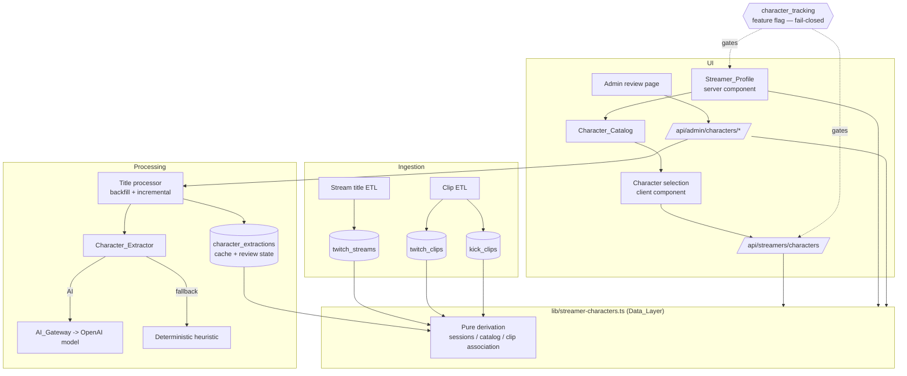
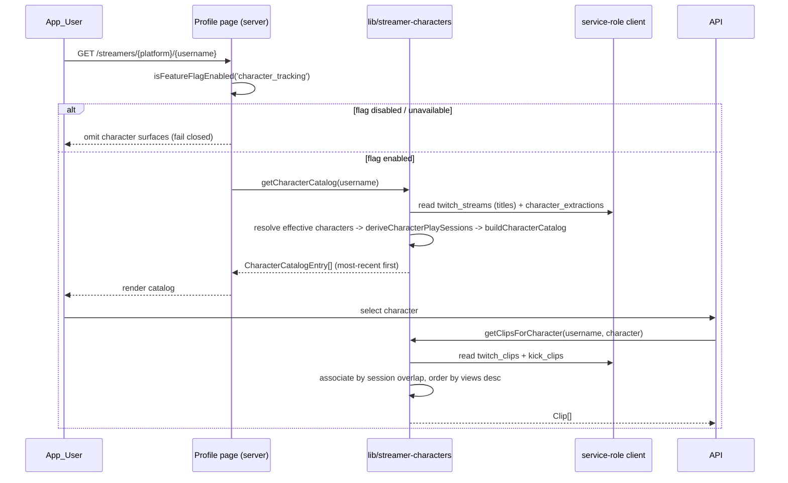
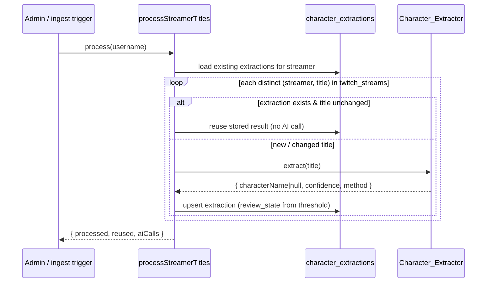

# Design Document

## Overview

Streamer Character Tracking extends the existing Streamer feature on RPStats.com. In GTA RP a streamer plays one or more named in-character personas (for example "Jean Paul" or "Yuno Sykk") and embeds the active character's name in the stream title in inconsistent formats. This feature:

1. Derives the set of **Characters** a streamer plays from their historical `stream_title` values in `twitch_streams` (the single stream table for both Twitch and Kick).
2. Builds **Character_Play_Sessions** — contiguous time windows during which the streamer was playing a single character.
3. Attributes **Clips** (and, where a source exists, VODs) to a character by **time overlap**: a clip belongs to the character whose play-session contains the clip's creation timestamp.
4. Surfaces a **Character_Catalog** on the Streamer_Profile and lets a viewer browse a character's clips.
5. Provides an **Admin_Review_Queue** for low-confidence extractions plus confirm / override / "no character" actions.

The feature is gated behind a new fail-closed feature flag and follows the established patterns of `lib/streamers.ts`: a migration-safe `lib/` data-access module through which every read routes, the `MinimalStreamerClient` injectable structural-client pattern, `escapeLikePattern` + `namesEqual` case-insensitive exact matching, a service-role client by default, injectable `now` for deterministic tests, and "log + return safe empty value" error handling.

### Key design decisions

| Decision | Rationale |
| --- | --- |
| Extraction is **cached per `(streamer, title text)`**, not per stream row | A streamer keeps one title across many polling rows in `twitch_streams`; caching at the distinct-title grain is the natural idempotency key (R2.8, R9.3) and makes the cache table double as the "processed" ledger for backfill (R9.1). |
| Sessions, catalog, and clip associations are **derived on read by pure functions** | A streamer's title/clip history is bounded and streamer-scoped, so on-read derivation is cheap, has no sync/staleness bugs, makes "recompute after an admin correction" automatic (R6.6), and makes idempotency (R9.4) trivially provable. Only one new persisted table is required. |
| Only **confirmed** extractions contribute to the catalog and sessions | R3.1 displays catalogs for streamers with at least one *confirmed* character; R6.2 auto-confirms at/above the threshold. Below-threshold results stay `pending` and are excluded until an admin acts, keeping the catalog accurate despite messy titles. |
| AI via the **Vercel AI Gateway** (`ai` package gateway provider) with a **deterministic heuristic fallback** | The Gateway gives one managed endpoint + key for the configured OpenAI model. The fallback guarantees a usable result and recorded method when the AI call fails or returns garbage (R2.4). |
| Session coverage uses **half-open, gap-capped time slabs** | Guarantees that different-character sessions never overlap (R4.5) and that every clip maps to at most one character, while still attributing clips that land between sparse polls. |

## Architecture

### System context



### Read path (Streamer_Profile)



### Processing path (backfill + incremental)



## Components and Interfaces

All new application code lives in:

- `lib/streamer-characters.ts` — Data_Layer module (mirrors `lib/streamers.ts`).
- `lib/character-extractor.ts` — Character_Extractor (AI Gateway + heuristic fallback).
- `app/api/streamers/characters/route.ts` — public read API for character selection.
- `app/api/admin/characters/route.ts` + actions — admin review queue + corrections.
- `components/streamers/character-catalog.tsx` — server-renderable catalog surface.
- `components/streamers/character-clips-panel.tsx` — `'use client'` character selection + clip panel.
- `components/admin/character-review-queue.tsx` — admin review UI.
- `lib/feature-flags-constants.ts` — add `CHARACTER_TRACKING` flag + add to `FAIL_CLOSED_FLAGS`.

### Feature flag

A new fail-closed flag is added alongside the existing `STREAMER_PAGES` flag:

```ts
// lib/feature-flags-constants.ts (additions)
export const FEATURE_FLAGS = {
  // ...existing...
  CHARACTER_TRACKING: 'character_tracking',
} as const;

export const FAIL_CLOSED_FLAGS = new Set<string>([
  // ...existing seven...
  FEATURE_FLAGS.CHARACTER_TRACKING,
]);
```

Server pages/routes gate with `isFeatureFlagEnabled(FEATURE_FLAGS.CHARACTER_TRACKING)` and export `dynamic = 'force-dynamic'`. Client surfaces use `isGatedFeatureEnabled(flags, 'character_tracking', loading)` so they hide while loading, on error, and when missing (R1.2, R1.4). A SQL seed migration (`api2db/sql/add_character_tracking_feature_flag.sql`) registers the flag disabled by default, mirroring `add_site_feature_enhancement_flags.sql` (including the `ON CONFLICT ... DO UPDATE` that never overwrites `is_enabled`).

### Character_Extractor (`lib/character-extractor.ts`)

```ts
/** How an extraction result was produced (recorded for audit — R2.7). */
export type ExtractionMethod = 'ai' | 'fallback';

/** Output of a single extraction (R2.1, R2.3). */
export interface CharacterExtractionResult {
  /** Normalized character name, or null for an explicit "no character found". */
  characterName: string | null;
  /** Confidence in the inclusive range 0.0–1.0 (R2.3). */
  confidence: number;
  /** Which path produced the result (R2.4, R2.7). */
  method: ExtractionMethod;
  /** The source title text the result was derived from (R2.7). */
  sourceTitle: string;
}

/** Zod schema used to validate the AI Gateway's structured response. */
export const AiExtractionSchema = z.object({
  characterName: z.string().nullable(),
  confidence: z.number().min(0).max(1),
});

/** Injectable AI caller so tests never hit the network. */
export interface CharacterAiClient {
  extract(title: string): Promise<{ characterName: string | null; confidence: number }>;
}

/**
 * Normalize a raw character name (R2.5): trim surrounding whitespace and
 * collapse internal whitespace runs to single spaces. Case is PRESERVED for
 * display; identity comparison is case-insensitive (see `charactersEqual`).
 * Returns '' for names that are empty after normalization.
 */
export function normalizeCharacterName(raw: string): string;

/** Case-insensitive identity over normalized names (R2.6). */
export function charactersEqual(a: string, b: string): boolean;

/**
 * Deterministic, network-free heuristic fallback (R2.4). Splits the title on
 * common GTA RP delimiters (| - – • / :), discards segments matching known
 * noise (server names, "GTA"/"RP"/"NoPixel" tags, !commands, emoji-only),
 * and returns the most plausible remaining segment as a normalized name with a
 * fixed modest confidence (default 0.4, below the threshold so it is reviewed),
 * or `{ characterName: null }` when nothing plausible remains.
 */
export function heuristicExtract(title: string): CharacterExtractionResult;

/**
 * Extract a character from a title (R2.1, R2.2, R2.4). Calls the configured
 * OpenAI model through the AI_Gateway; on thrown error, schema-validation
 * failure, or unusable output, falls back to {@link heuristicExtract} and marks
 * `method: 'fallback'`. The returned `characterName` is always normalized.
 */
export async function extractCharacterFromTitle(
  title: string,
  aiClient?: CharacterAiClient,
): Promise<CharacterExtractionResult>;
```

AI Gateway provider configuration (no secrets in code) — the key and model id come from environment:

```ts
// Conceptual; uses the `ai` package gateway provider + generateObject.
import { gateway } from 'ai';
import { generateObject } from 'ai';

const MODEL_ID = process.env.AI_GATEWAY_MODEL ?? 'openai/gpt-4o-mini';
// AI_GATEWAY_API_KEY is read by the gateway provider from the environment.

async function callGateway(title: string) {
  const { object } = await generateObject({
    model: gateway(MODEL_ID),
    schema: AiExtractionSchema,
    prompt: buildExtractionPrompt(title),
  });
  return object; // { characterName, confidence }
}
```

New environment variables (documented in `env.sample`, values never committed):
- `AI_GATEWAY_API_KEY` — the single Vercel AI Gateway key (replaces the `GROK_API_KEY` / `GROK_MODEL` assumptions for this feature).
- `AI_GATEWAY_MODEL` — optional OpenAI model id, default `openai/gpt-4o-mini`.
- `CHARACTER_CONFIDENCE_THRESHOLD` — optional override of the default `Confidence_Threshold` (default `0.7`).

### Data_Layer (`lib/streamer-characters.ts`)

This module reuses the `MinimalStreamerClient` structural client, `escapeLikePattern`, and `namesEqual` from the established pattern, defaults to the service-role client, and accepts an injectable `now`.

```ts
import type { Clip, StreamerPlatform } from './streamers';

/** Review/resolution state of a stored extraction. */
export type ReviewState = 'pending' | 'confirmed' | 'overridden' | 'rejected';

/** A persisted extraction row mapped to domain shape (R2.7). */
export interface StoredExtraction {
  id: number;
  streamerName: string;
  sourceTitle: string;
  characterName: string | null;   // extractor's normalized name (null = none)
  confidence: number;
  method: ExtractionMethod;
  reviewState: ReviewState;
  overrideName: string | null;     // admin correction (R6.4)
  reviewedBy: string | null;
  reviewedAt: string | null;
}

/** One contiguous play window for a single character (R4). */
export interface CharacterPlaySession {
  characterName: string;
  start: string;                   // ISO; start <= end (R4.4)
  end: string;                     // ISO
  titleRecordCount: number;
}

/** A catalog entry shown on the profile (R3). */
export interface CharacterCatalogEntry {
  characterName: string;
  firstSeen: string;
  lastSeen: string;                // most-recent observation (R3.3)
  sourceTitleCount: number;
  clipCount: number;
}

/** A review-queue item for the admin UI (R6.1). */
export interface ReviewQueueItem extends StoredExtraction {
  streamerDisplayName: string;
}

/** A time-ordered, character-resolved title record (input to derivation). */
export interface ResolvedTitleRecord {
  id: number;
  timestamp: string;               // twitch_streams.created_at
  character: string | null;        // effective character (null = excluded)
}

/* ---- Pure derivation core (the property-tested surface) ---- */

/** Resolve a stored extraction to its EFFECTIVE character or null (R6). */
export function resolveEffectiveCharacter(e: StoredExtraction): string | null;

/**
 * Derive non-overlapping play sessions from time-ordered resolved records
 * (R4). Records resolving to null are separators. Coverage uses half-open,
 * gap-capped slabs (see "Core algorithms"). Deterministic and pure.
 */
export function deriveCharacterPlaySessions(
  records: ResolvedTitleRecord[],
  opts?: { sessionTailMs?: number },
): CharacterPlaySession[];

/** Build the catalog (distinct characters, most-recent first) from sessions (R3). */
export function buildCharacterCatalog(
  sessions: CharacterPlaySession[],
  clipsByCharacter: Map<string, number>,
): CharacterCatalogEntry[];

/** The character whose session contains the clip's timestamp, or null (R5). */
export function associateClipToCharacter(
  clipCreatedAt: string,
  sessions: CharacterPlaySession[],
): string | null;

/* ---- Async reads (route through the Data_Layer; service-role default) ---- */

export function getCharacterCatalog(
  username: string,
  client?: MinimalStreamerClient,
  now?: Date,
): Promise<CharacterCatalogEntry[]>;

export function getCharacterPlaySessions(
  username: string,
  client?: MinimalStreamerClient,
  now?: Date,
): Promise<CharacterPlaySession[]>;

export function getClipsForCharacter(
  username: string,
  characterName: string,
  client?: MinimalStreamerClient,
  now?: Date,
): Promise<Clip[]>;

export function getCharacterReviewQueue(
  opts?: { limit?: number },
  client?: MinimalStreamerClient,
): Promise<ReviewQueueItem[]>;

/* ---- Processing + admin actions ---- */

export interface ProcessResult { processed: number; reused: number; aiCalls: number; }

/** Backfill/incremental: process unprocessed (streamer,title) pairs (R9). */
export function processStreamerTitles(
  username: string,
  opts?: { aiClient?: CharacterAiClient },
  client?: MinimalStreamerClient,
  now?: Date,
): Promise<ProcessResult>;

export type AdminAction =
  | { kind: 'confirm'; extractionId: number; reviewer: string }
  | { kind: 'override'; extractionId: number; name: string; reviewer: string }
  | { kind: 'no-character'; extractionId: number; reviewer: string };

/** Apply an admin correction; the next read re-derives sessions/clips (R6.6). */
export function applyAdminReview(
  action: AdminAction,
  client?: MinimalStreamerClient,
): Promise<{ success: boolean }>;
```

### UI components

- `components/streamers/character-catalog.tsx` (server-renderable) — renders the list of `CharacterCatalogEntry` most-recent first (R3.1, R3.2), each with its last-seen date (R3.3); shows a "no characters identified" message when empty (R3.4). Composed into `streamer-profile-view.tsx` below the existing clip history, only when the flag is enabled.
- `components/streamers/character-clips-panel.tsx` (`'use client'`) — character selection (R3.5) that fetches `/api/streamers/characters?username=&character=` and renders the returned clips ordered by views desc (R5.4), with a "no clips" message (R5.5). Mirrors the existing `viewer-trend-chart.tsx` + `viewer-trend/route.ts` client+API seam so service-role reads stay server-side (R8.1). The VOD surface is conditionally rendered only when the API returns a non-empty VOD payload; its absence renders nothing (R7.4).
- `components/admin/character-review-queue.tsx` — lists `ReviewQueueItem`s and posts confirm / override / no-character actions to `app/api/admin/characters` (admin-auth-gated like `app/api/admin/data/backfill/route.ts`).

## Data Models

One new persisted table is introduced. Sessions, catalog, and clip associations are derived on read and are **not** persisted, so there is no projection to keep in sync (this is what makes R6.6 recompute and R9.4 idempotency automatic).

### `character_extractions`

Stores one row per distinct `(streamer, title text)` — the extraction record (R2.7), the idempotency cache (R2.8, R9.3), and the admin review state (R6). Follows the established table pattern: `create table if not exists`, RLS enabled, **no public SELECT policy**, quoted camelCase `"serverId"`, privileged reads via the service-role client server-side (R8.2).

```sql
-- api2db/sql/create_character_extractions.sql
-- Character extraction cache + review state for Streamer Character Tracking.
-- One row per distinct (streamer, title text). Accumulates over time.

create table if not exists public.character_extractions (
  id bigint generated by default as identity not null,
  created_at timestamp with time zone null default CURRENT_TIMESTAMP,
  updated_at timestamp with time zone null default CURRENT_TIMESTAMP,
  streamer_name text not null,
  source_title text not null,
  -- Extractor output (R2.1, R2.7). character_name null => "no character found".
  character_name text null,
  confidence numeric(4, 3) not null check (confidence >= 0 and confidence <= 1),
  extraction_method text not null check (extraction_method in ('ai', 'fallback')),
  -- Review/resolution state (R6). Auto 'confirmed' when confidence >= threshold,
  -- else 'pending'. Admin actions set 'confirmed'/'overridden'/'rejected'.
  review_state text not null default 'pending'
    check (review_state in ('pending', 'confirmed', 'overridden', 'rejected')),
  override_name text null,                       -- admin correction (R6.4)
  reviewed_by text null,
  reviewed_at timestamp with time zone null,
  constraint character_extractions_pkey primary key (id)
) TABLESPACE pg_default;

-- Idempotency key: at most one extraction per (streamer, title), case-insensitive
-- on the streamer (R2.8, R9.3). Titles are short; safe to index directly.
create unique index if not exists uq_char_extractions_streamer_title
  on public.character_extractions (lower(streamer_name), source_title);

-- Primary lookup: all extractions for a streamer.
create index if not exists idx_char_extractions_streamer
  on public.character_extractions (lower(streamer_name));

-- Review queue scan: pending results ordered by confidence.
create index if not exists idx_char_extractions_review
  on public.character_extractions (review_state, confidence)
  where review_state = 'pending';

-- Enable RLS (no public SELECT policy — service-role reads only). (R8.2)
alter table public.character_extractions enable row level security;

comment on table public.character_extractions is
  'Per-(streamer,title) character extraction cache + review state. RLS on, service-role reads only.';
```

### Derived (in-memory, not persisted)

- **Character_Play_Session** — derived from `twitch_streams` rows (timestamp + title) joined to `character_extractions` via `resolveEffectiveCharacter`, by `deriveCharacterPlaySessions` (R4).
- **Character_Catalog** — derived from sessions by `buildCharacterCatalog`: distinct characters, `lastSeen = max session end`, `firstSeen = min session start`, ordered most-recent first (R3).
- **Clip association** — computed by `associateClipToCharacter`: a clip belongs to the character of the session whose half-open interval contains the clip's `createdAt` (R5).

### Existing tables consumed (read-only, unchanged)

| Table | Columns used | Purpose |
| --- | --- | --- |
| `twitch_streams` | `streamer_name`, `stream_title`, `created_at`, `id` | Title records → characters + session timestamps (single table for both platforms). |
| `twitch_clips` | `streamer_username`, `clip_title`, `view_count`, `twitch_created_at`, `is_valid`, `embed_url`, ... | Twitch clips for association. |
| `kick_clips` | `streamer_username`, `clip_title`, `view_count`, `kick_created_at`, `is_valid`, `clip_url`, `channel_slug`, ... | Kick clips for association. |

### Core algorithms (these drive the correctness properties)

**1. Character name normalization (R2.5, R2.6).**
`normalizeCharacterName(raw)`:
1. Trim leading/trailing whitespace.
2. Collapse every internal run of whitespace (spaces, tabs, newlines) to a single ASCII space.
3. Preserve case for display.
Identity (`charactersEqual`) compares the two normalized names case-insensitively. Two records for the same streamer whose normalized names are equal under case-insensitive comparison are the *same* character. Normalization is idempotent: `normalize(normalize(x)) === normalize(x)`.

**2. Effective character resolution (R6).**
`resolveEffectiveCharacter(e)`:
- `e.reviewState === 'rejected'` → `null` (admin "no character", R6.5).
- `e.reviewState === 'pending'` → `null` (below threshold, not yet confirmed — excluded from catalog/sessions, R3.1/R6.1).
- `e.reviewState === 'confirmed' | 'overridden'` → `normalize(e.overrideName ?? e.characterName)`, or `null` when that is empty/none.

**3. Character_Play_Session derivation (R4).**
Input: the streamer's title records, each resolved to an effective character (or `null`). Let `SESSION_TAIL_MS` be the configured slab cap (default `10 * 60 * 1000`, aligned with `STREAMER_LIVE_FRESHNESS_MS`).
1. Sort records ascending by `(created_at, id)` — a total order (ids are unique).
2. For record `k` at time `t_k`, define its coverage slab as the half-open interval `[t_k, min(t_{k+1}, t_k + SESSION_TAIL_MS))`; for the final record use `[t_n, t_n + SESSION_TAIL_MS)`. Slabs are pairwise disjoint and never overlap.
3. A **session** is a maximal union of *consecutive* slabs whose records resolve to the **same** real character **and** are contiguous (`slab_k.end === t_{k+1}`, i.e. the gap to the next record is ≤ `SESSION_TAIL_MS`). `null` records contribute no slab and break runs.
4. `session.start = t_first`; `session.end = slab_last.end`. Because `SESSION_TAIL_MS > 0`, `start < end` (so `start <= end`, R4.4).
Consequences: consecutive same-character records within the cap group into one session (R4.2); a character change or an excluded/`null` record ends the current session and the next character starts a new one at its boundary (R4.3); because slabs are disjoint half-open intervals, **no two sessions of different characters overlap** (R4.5); and a character may legitimately have multiple sessions when separated by a gap or another character (R4.1).

**4. Clip-to-character association by time overlap (R5).**
`associateClipToCharacter(clipCreatedAt, sessions)` returns the `characterName` of the unique session whose half-open `[start, end)` contains `clipCreatedAt`, or `null` if none. Because session intervals are pairwise disjoint, a clip matches at most one character. `getClipsForCharacter` returns exactly the clips that associate to the requested character (no extras, no omissions), ordered by `view_count` descending (R5.4); clips whose timestamp lies in no session are excluded from every character (R5.3).

**5. Streamer matching (R8.3).**
Every read narrows at the database with a wildcard-escaped `ilike(escapeLikePattern(username))` and re-filters in memory with `namesEqual` (case-insensitive exact equality), so a record is attributed to a streamer only when the username is exactly equal under case-insensitive comparison — `_`/`%` in a username never over-match.

**6. Idempotent processing (R2.8, R9.3, R9.4).**
`processStreamerTitles` loads existing extractions, and for each distinct `(streamer, title)` reuses the stored result when the title is unchanged (no AI call) and only calls the extractor for new/changed titles. Because the catalog and sessions are a *pure deterministic function* of the resolved extractions and the title timestamps, processing the same titles with unchanged admin corrections any number of times yields identical catalog and sessions (R9.4), and applying an admin correction changes the derived output deterministically on the next read (R6.6).

## Correctness Properties

*A property is a characteristic or behavior that should hold true across all valid executions of a system — essentially, a formal statement about what the system should do. Properties serve as the bridge between human-readable specifications and machine-verifiable correctness guarantees.*

### Property reflection (redundancy elimination)

Before finalizing, the testable criteria from the prework were consolidated to remove logical redundancy:

- **1.2 + 1.4** → one fail-closed gating property: any non-explicitly-true flag state (disabled, missing, errored, loading) hides the surface.
- **2.1 + 2.7** → one result well-formedness property (the recorded fields *are* the result shape).
- **2.8 + 9.3** → one "no redundant AI call on unchanged titles" property (single-record and batch grain are the same rule).
- **3.2 + 3.3** → one catalog property covering both the ordering (most-recent first) and the `lastSeen` value.
- **4.2 + 4.3** → one session-structure property (same-character runs merge; a change/exclusion starts a new session). 4.1 (coverage) kept separate as it asserts containment, not merging.
- **5.1 + 5.2 + 5.3** → one clip-association exactness property ("exactly the associated clips — no extras, no omissions"); the positive (5.1) and exclusion (5.3) halves are both implied by exactness. (Mirrors the Property 15/16 style in `lib/streamers.ts`.)
- **6.1 + 6.2** → one threshold-partition property.
- **6.6** is subsumed by Properties 18, 19, and 23: because sessions/clips are derived on read, a confirm/override/reject deterministically changes the next derivation, which the resolution and idempotency properties already validate.
- **9.1 + 9.2** → one "processes exactly the unprocessed records" property.
- **3.5** is validated by the clip-association exactness property (Property 14).

Non-testable criteria (excluded, with reason): **1.3** (propagation timing/infrastructure), **8.1** (architectural — no direct DB client in pages/routes; enforced structurally), **8.2** (DDL/security config — verified by schema review). Example-based criteria (covered by unit tests, see Testing Strategy): **1.1, 2.2, 3.4, 5.5, 7.3, 7.4**.

### Property 1: Fail-closed feature gating

*For any* resolved flag map and loading state, the character-tracking gating decision is `true` only when the `character_tracking` flag is explicitly `true` and not loading; in every other case (disabled, missing, errored, or loading) it is `false`.

**Validates: Requirements 1.2, 1.4**

### Property 2: Extraction result is well-formed and complete

*For any* stream title, the extractor's result has `characterName` equal to either `null` ("no character found") or a normalized non-empty string, together with a `confidence`, a `method` (`'ai'` or `'fallback'`), and the original `sourceTitle`.

**Validates: Requirements 2.1, 2.7**

### Property 3: Confidence is within range

*For any* stream title and *any* (mocked) AI output — including out-of-range, missing, or invalid values — the `confidence` the extractor returns is within the inclusive range 0.0 to 1.0.

**Validates: Requirements 2.3**

### Property 4: Deterministic fallback on AI failure

*For any* stream title, when the AI client throws or returns schema-invalid/unusable output, the extractor returns a well-formed result with `method === 'fallback'`.

**Validates: Requirements 2.4**

### Property 5: Name normalization

*For any* string, `normalizeCharacterName` returns a value with no leading or trailing whitespace and no internal run of more than one whitespace character, and normalization is idempotent (`normalize(normalize(x)) === normalize(x)`).

**Validates: Requirements 2.5**

### Property 6: Case-insensitive character identity

*For any* two strings whose normalized forms are equal under case-insensitive comparison, `charactersEqual` returns `true`, and title records yielding such names for the same streamer collapse into a single catalog character.

**Validates: Requirements 2.6**

### Property 7: Unchanged titles are not re-sent to the AI

*For any* set of title records, processing them a second time with unchanged title text issues zero new AI extraction requests and returns the previously stored results.

**Validates: Requirements 2.8, 9.3**

### Property 8: Catalog characters are distinct and confirmed-only

*For any* set of derived sessions, `buildCharacterCatalog` produces entries with pairwise-distinct character names, and every catalog character corresponds to an effective (confirmed/overridden, non-null) character — no pending or rejected extraction appears.

**Validates: Requirements 3.1**

### Property 9: Catalog ordering and most-recent date

*For any* set of derived sessions, the catalog is ordered by `lastSeen` descending (most recently played first), and each entry's `lastSeen` equals the maximum session end across that character's sessions.

**Validates: Requirements 3.2, 3.3**

### Property 10: Sessions cover their records

*For any* time-ordered resolved title records, every record that resolves to a real (non-null) character is contained within exactly one session for that same character.

**Validates: Requirements 4.1**

### Property 11: Session grouping and boundaries

*For any* time-ordered resolved title records, consecutive records resolving to the same character within the gap cap are grouped into a single session, and any character change or excluded/`null` record ends the current session and starts a new session at the next real-character record.

**Validates: Requirements 4.2, 4.3**

### Property 12: Session start precedes or equals end

*For any* set of derived sessions, every session has `start <= end`.

**Validates: Requirements 4.4**

### Property 13: Different-character sessions never overlap

*For any* set of derived sessions for a single streamer, every pair of sessions belonging to different characters has disjoint time intervals.

**Validates: Requirements 4.5**

### Property 14: Clip-to-character association is exact

*For any* set of clips and derived sessions, `getClipsForCharacter(c)` returns exactly the clips whose creation timestamp falls within a session of character `c` — no clip belonging to another character or to no session is included (no extras), and no clip inside a session of `c` is omitted (no omissions).

**Validates: Requirements 5.1, 5.2, 5.3, 3.5**

### Property 15: Clips ordered by view count descending

*For any* set of clips associated with a selected character, the returned list is ordered by `viewCount` in non-increasing order.

**Validates: Requirements 5.4**

### Property 16: Confidence threshold partitions confirmation vs review

*For any* extraction result, when its `confidence` is below the `Confidence_Threshold` it is `pending` and appears in the review queue, and when its `confidence` is at or above the threshold it is `confirmed` and does not appear in the review queue.

**Validates: Requirements 6.1, 6.2**

### Property 17: Confirm transition removes from queue

*For any* pending extraction, applying an admin `confirm` action sets its review state to confirmed and the extraction no longer appears in the review queue.

**Validates: Requirements 6.3**

### Property 18: Override sets the confirmed effective name

*For any* extraction and *any* non-empty override name, after an admin `override`, `resolveEffectiveCharacter` returns the normalized override name and the next catalog/session derivation reflects that name.

**Validates: Requirements 6.4, 6.6**

### Property 19: "No character" excludes the record from all sessions

*For any* set of records, marking one record as "no character" (rejected) causes the next session derivation to treat it as a separator, so it is contained in no session for any character.

**Validates: Requirements 6.5, 6.6**

### Property 20: Case-insensitive exact streamer matching

*For any* stored records and *any* query username, a record is attributed to the streamer only when its username equals the query case-insensitively; usernames differing in any character (including ones containing `_` or `%`) are never attributed.

**Validates: Requirements 8.3**

### Property 21: Reads fail safe

*For any* Data_Layer read whose injected client returns an error, the function logs and returns a safe empty value (`[]` or `null`) without throwing.

**Validates: Requirements 8.4**

### Property 22: Backfill processes exactly the unprocessed records

*For any* set of title records of which some are already processed, `processStreamerTitles` extracts exactly the records not yet processed (newly ingested or never seen) and leaves already-processed unchanged-title records untouched.

**Validates: Requirements 9.1, 9.2**

### Property 23: Idempotent catalog and sessions

*For any* set of title records and admin corrections, processing them more than once with unchanged titles and corrections yields a Character_Catalog and set of Character_Play_Sessions identical to processing them once (`derive(x) === derive(derive(x))`).

**Validates: Requirements 9.4, 6.6**

### Property 24: VOD overlap association is exact (conditional — pending a VOD source)

*For any* set of VOD intervals and derived sessions, when a VOD data source is available, a VOD is associated with exactly the characters whose session intervals overlap the VOD's interval. This property is implemented against the pure overlap helper now and exercised end-to-end only once a VOD source exists; when no source is configured the VOD reads return `[]` and the surface is omitted (validated by an example test).

**Validates: Requirements 7.1, 7.2**

## Error Handling

Following `lib/streamers.ts` "log + return safe empty value":

- **Data_Layer reads** (`getCharacterCatalog`, `getCharacterPlaySessions`, `getClipsForCharacter`, `getCharacterReviewQueue`, VOD reads): on a client/query error, log via `console.error` and return `[]`; functions returning a single object return `null`. They never throw (Property 21). Empty/whitespace usernames short-circuit to the empty value before any query.
- **Per-source isolation**: clip association reads `twitch_clips` and `kick_clips` independently; an error on one source is logged and skipped so the other still contributes, mirroring `streamerHasClipsOrStreams`.
- **Character_Extractor**: AI errors, timeouts, and schema-validation failures are caught and routed to `heuristicExtract`, recording `method: 'fallback'` (Property 4). The heuristic is pure and total — it always returns a well-formed result (Property 2), so extraction never throws.
- **Processing** (`processStreamerTitles`): a failed extraction or upsert for one title is logged and skipped; the batch continues and the result counts reflect what was processed. A unique-constraint conflict on `(lower(streamer_name), source_title)` is treated as "already processed" (reuse), preserving idempotency.
- **Admin actions** (`applyAdminReview`): validate input with zod at the route boundary; an unknown `extractionId` or write error returns `{ success: false }` and is surfaced to the admin UI without mutating other rows.
- **Feature flag**: any failure to read the flag resolves to disabled (fail closed) on both server (`isFeatureFlagEnabled` returns `false`) and client (`isGatedFeatureEnabled` returns `false` while loading/missing) — Property 1.
- **API routes**: fail-closed gate returns `404` when `character_tracking` is disabled; invalid query params return `400`; unexpected errors return `500` with a generic message and a server-side log (mirrors `viewer-trend/route.ts`).

## Testing Strategy

The feature uses a **dual approach**: property-based tests for universal correctness and unit tests for specific examples, integration points, and edge cases. Both are required and complementary.

### Property-based testing

- **Library**: `fast-check` (already a devDependency). Do not hand-roll property testing.
- **Run count**: every property test runs at least 100 iterations via the shared `assertProperty` / `withMinRuns` helpers in `__tests__/pbt-helpers.ts` (enforced `MIN_NUM_RUNS = 100`).
- **One test per property**: each of Properties 1–24 is implemented by a single property-based test.
- **Tagging**: each test is tagged with a comment in the format
  `// Feature: streamer-character-tracking, Property {number}: {property_text}`.
- **Determinism**: the pure derivation core (`normalizeCharacterName`, `charactersEqual`, `resolveEffectiveCharacter`, `deriveCharacterPlaySessions`, `buildCharacterCatalog`, `associateClipToCharacter`) is exercised directly. Async reads inject a deterministic `MinimalStreamerClient` fake and a fixed `now`; the extractor injects a `CharacterAiClient` fake (including one that throws / returns invalid output for Property 4). No test touches the network or a live database.

**Generators** (added to `__tests__/arbitraries.ts`):
- `titleArbitrary` — realistic GTA RP titles with embedded names, delimiters, noise tags, emoji, and unicode (drives Properties 2–6).
- `whitespaceVariantArbitrary` — strings with leading/trailing/internal whitespace runs and mixed case (Properties 5, 6).
- `resolvedRecordsArbitrary` — time-ordered records with characters, `null` separators, duplicate timestamps, and gap variety (Properties 8–13, 23).
- `clipArbitrary` — clips with timestamps inside, between, and outside sessions, with varied `viewCount` (Properties 14, 15).
- `extractionArbitrary` — extractions across the full `[0,1]` confidence range and all review states (Properties 16–19).
- `usernameCasingArbitrary` — usernames differing only in case plus `_`/`%` decoys (Property 20).

**Property → test mapping**: the property-based suite (`__tests__/streamer-characters.test.ts`, `__tests__/character-extractor.test.ts`) implements Properties 1–24. Property 24 is implemented against the pure VOD-overlap helper and marked pending end-to-end until a VOD source exists.

### Unit testing

Focused unit tests cover the example-based and structural criteria not expressed as properties:
- **R1.1** — `CHARACTER_TRACKING` flag constant exists and is a member of `FAIL_CLOSED_FLAGS`.
- **R2.2** — for a new title, `extractCharacterFromTitle` invokes the injected AI client exactly once (gateway path), and reuse path invokes it zero times.
- **R3.4 / R5.5 / R7.3** — empty-state messages render when the catalog / clip list / VOD list is empty.
- **R7.4** — with no VOD source configured, the VOD read returns `[]` and never throws, and the surface is omitted.
- **Integration** — `app/api/streamers/characters/route.ts` returns `404` when the flag is off, `400` on bad params, and well-formed clip payloads when enabled; `app/api/admin/characters` enforces admin auth before mutating.
- **Edge cases** — empty/whitespace usernames, a single title record (one session, `start < end`), all-`null` records (no sessions), clips exactly on a session boundary (half-open `[start, end)` semantics), and ties in `viewCount` ordering.

Unit-test balance: keep example tests focused on concrete behavior and edge cases; rely on the property tests for broad input coverage rather than enumerating many example cases.
