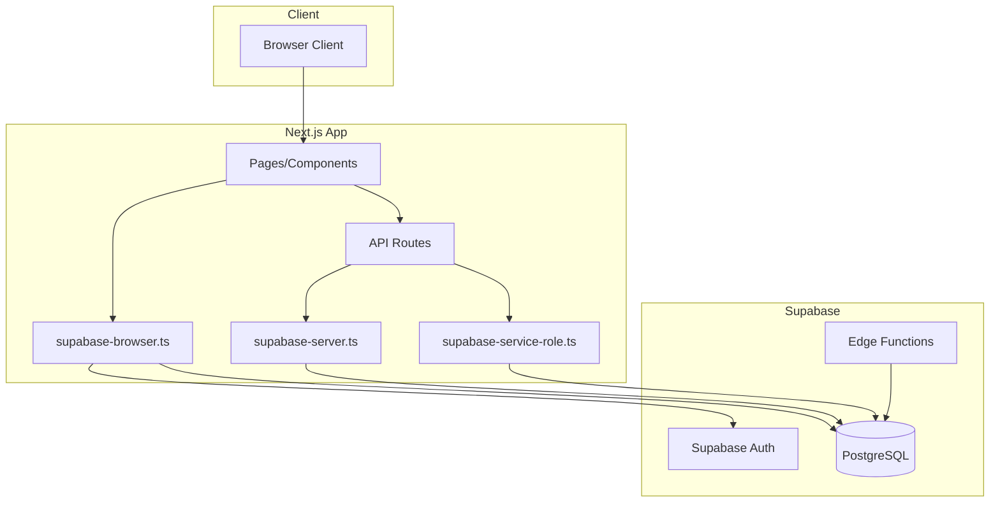
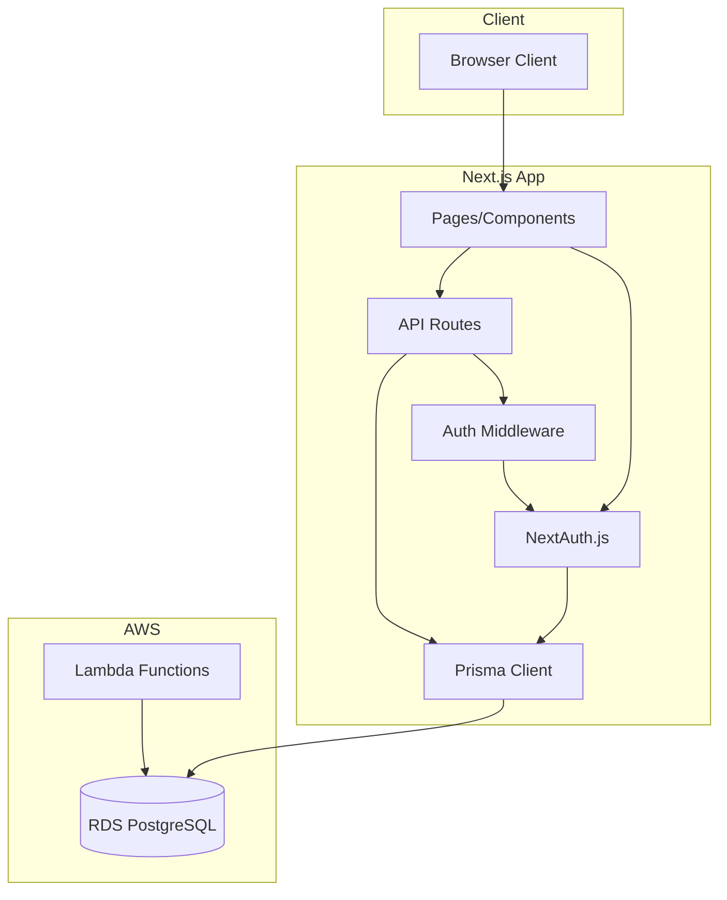

# Design Document: Supabase to Prisma/RDS Migration

## Overview

This document outlines the technical design for migrating RPStats.com from Supabase (PostgreSQL, Auth, Edge Functions) to AWS RDS PostgreSQL with Prisma ORM and NextAuth.js for authentication. The migration will replace all Supabase client calls with Prisma queries while maintaining existing functionality and improving type safety.

## Architecture

### Current Architecture (Supabase)



### Target Architecture (Prisma + RDS + NextAuth)



## Components and Interfaces

### 1. Prisma Schema

The Prisma schema will be generated from the existing Supabase database structure. Key models include:

```prisma
// prisma/schema.prisma

generator client {
  provider = "prisma-client-js"
}

datasource db {
  provider = "postgresql"
  url      = env("DATABASE_URL")
}

// NextAuth.js required models
model Account {
  id                String  @id @default(cuid())
  userId            String
  type              String
  provider          String
  providerAccountId String
  refresh_token     String? @db.Text
  access_token      String? @db.Text
  expires_at        Int?
  token_type        String?
  scope             String?
  id_token          String? @db.Text
  session_state     String?
  user              User    @relation(fields: [userId], references: [id], onDelete: Cascade)

  @@unique([provider, providerAccountId])
}

model Session {
  id           String   @id @default(cuid())
  sessionToken String   @unique
  userId       String
  expires      DateTime
  user         User     @relation(fields: [userId], references: [id], onDelete: Cascade)
}

model User {
  id            String    @id @default(cuid())
  name          String?
  email         String?   @unique
  emailVerified DateTime?
  image         String?
  accounts      Account[]
  sessions      Session[]
  appUser       AppUser?
  adminUser     AdminUser?
  roadmapVotes  RoadmapVote[]
  bannerDismissals NotificationBannerDismissal[]
}

model VerificationToken {
  identifier String
  token      String   @unique
  expires    DateTime

  @@unique([identifier, token])
}

// Application models
model AppUser {
  id          Int      @id @default(autoincrement())
  userId      String   @unique
  user        User     @relation(fields: [userId], references: [id], onDelete: Cascade)
  discordId   String?
  username    String?
  avatarUrl   String?
  lastLoginAt DateTime @default(now())
  createdAt   DateTime @default(now())

  @@map("app_users")
}

model AdminUser {
  id        Int      @id @default(autoincrement())
  userId    String   @unique
  user      User     @relation(fields: [userId], references: [id], onDelete: Cascade)
  email     String
  createdAt DateTime @default(now())

  @@map("admin_users")
}

model PlayerCount {
  id          Int      @id @default(autoincrement())
  serverId    String   @map("server_id")
  timestamp   DateTime
  playerCount Int      @map("player_count")
  createdAt   DateTime @default(now()) @map("created_at")

  @@index([serverId, timestamp])
  @@map("player_counts")
}

model ServerCapacity {
  id          Int      @id @default(autoincrement())
  serverId    String   @map("server_id")
  timestamp   DateTime
  maxCapacity Int      @map("max_capacity")
  createdAt   DateTime @default(now()) @map("created_at")

  @@index([serverId, timestamp])
  @@map("server_capacity")
}

model ServerXref {
  id         Int      @id @default(autoincrement())
  serverId   String   @unique @map("server_id")
  serverName String   @map("server_name")
  order      Int?
  createdAt  DateTime @default(now()) @map("created_at")

  @@map("server_xref")
}

model ServerResourceSnapshot {
  id        Int      @id @default(autoincrement())
  serverId  String   @map("server_id")
  timestamp DateTime
  resources String[]
  createdAt DateTime @default(now()) @map("created_at")

  @@index([serverId, timestamp])
  @@map("server_resource_snapshots")
}

model ServerResourceChange {
  id               Int      @id @default(autoincrement())
  serverId         String   @map("server_id")
  timestamp        DateTime
  addedResources   String[] @map("added_resources")
  removedResources String[] @map("removed_resources")
  createdAt        DateTime @default(now()) @map("created_at")

  @@index([serverId, timestamp])
  @@map("server_resource_changes")
}

model TwitchStream {
  id           Int      @id @default(autoincrement())
  createdAt    DateTime @default(now()) @map("created_at")
  streamerName String   @map("streamer_name")
  streamTitle  String   @map("stream_title")
  viewerCount  Int      @map("viewer_count")
  gameName     String   @map("game_name")
  serverId     String   @map("serverId")

  @@map("twitch_streams")
}

model NotificationBanner {
  id              Int      @id @default(autoincrement())
  createdAt       DateTime @default(now()) @map("created_at")
  updatedAt       DateTime @updatedAt @map("updated_at")
  title           String
  message         String
  messageMarkdown String?  @map("message_markdown")
  type            BannerType @default(info)
  priority        Int      @default(0)
  isActive        Boolean  @default(true) @map("is_active")
  isDismissible   Boolean  @default(true) @map("is_dismissible")
  startDate       DateTime? @map("start_date")
  endDate         DateTime? @map("end_date")
  actionText      String?  @map("action_text")
  actionUrl       String?  @map("action_url")
  actionTarget    ActionTarget? @map("action_target")
  backgroundColor String?  @map("background_color")
  textColor       String?  @map("text_color")
  borderColor     String?  @map("border_color")
  createdBy       String?  @map("created_by")
  viewCount       Int      @default(0) @map("view_count")
  dismissCount    Int      @default(0) @map("dismiss_count")
  dismissals      NotificationBannerDismissal[]

  @@map("notification_banners")
}

model NotificationBannerDismissal {
  id          Int      @id @default(autoincrement())
  bannerId    Int      @map("banner_id")
  userId      String   @map("user_id")
  dismissedAt DateTime @default(now()) @map("dismissed_at")
  banner      NotificationBanner @relation(fields: [bannerId], references: [id], onDelete: Cascade)
  user        User     @relation(fields: [userId], references: [id], onDelete: Cascade)

  @@unique([bannerId, userId])
  @@map("notification_banner_dismissals")
}

model SystemSetting {
  id          String   @id @default(cuid())
  key         String   @unique
  value       String
  dataType    DataType @default(string) @map("data_type")
  description String?
  category    String?
  updatedAt   DateTime @updatedAt @map("updated_at")
  updatedBy   String?  @map("updated_by")
  createdAt   DateTime @default(now()) @map("created_at")

  @@map("system_settings")
}

model SiteUpdate {
  id              Int      @id @default(autoincrement())
  createdAt       DateTime @default(now()) @map("created_at")
  updatedAt       DateTime @updatedAt @map("updated_at")
  title           String
  content         String
  contentMarkdown String?  @map("content_markdown")
  type            String   @default("update")
  priority        Int      @default(0)
  tags            String[]
  isPublished     Boolean  @default(false) @map("is_published")
  publishDate     DateTime? @map("publish_date")
  createdBy       String?  @map("created_by")
  viewCount       Int      @default(0) @map("view_count")

  @@map("site_updates")
}

model RoadmapItem {
  id                  Int      @id @default(autoincrement())
  createdAt           DateTime @default(now()) @map("created_at")
  updatedAt           DateTime @updatedAt @map("updated_at")
  title               String
  description         String
  descriptionMarkdown String?  @map("description_markdown")
  status              String   @default("planned")
  priority            Int      @default(0)
  category            String?
  isPublished         Boolean  @default(false) @map("is_published")
  displayOrder        Int      @default(0) @map("display_order")
  voteCount           Int      @default(0) @map("vote_count")
  createdBy           String?  @map("created_by")
  votes               RoadmapVote[]

  @@map("roadmap_items")
}

model RoadmapVote {
  id            Int      @id @default(autoincrement())
  roadmapItemId Int      @map("roadmap_item_id")
  userId        String   @map("user_id")
  votedAt       DateTime @default(now()) @map("voted_at")
  roadmapItem   RoadmapItem @relation(fields: [roadmapItemId], references: [id], onDelete: Cascade)
  user          User     @relation(fields: [userId], references: [id], onDelete: Cascade)

  @@unique([roadmapItemId, userId])
  @@map("roadmap_votes")
}

model FeatureFlag {
  id          Int      @id @default(autoincrement())
  key         String   @unique
  name        String
  description String?
  isEnabled   Boolean  @default(false) @map("is_enabled")
  category    String?
  createdAt   DateTime @default(now()) @map("created_at")
  updatedAt   DateTime @updatedAt @map("updated_at")

  @@map("feature_flags")
}

model ServerRestartPrediction {
  id                  Int      @id @default(autoincrement())
  serverId            String   @unique @map("server_id")
  nextRestartTime     DateTime? @map("next_restart_time")
  confidence          Float    @default(0)
  detectedPattern     String?  @map("detected_pattern")
  lastRestartTime     DateTime? @map("last_restart_time")
  averageDowntime     Int      @default(0) @map("average_downtime")
  patternType         String?  @map("pattern_type")
  patternInterval     Int?     @map("pattern_interval")
  patternTimeOfDay    String?  @map("pattern_time_of_day")
  patternVariance     Float    @default(0) @map("pattern_variance")
  patternOccurrences  Int      @default(0) @map("pattern_occurrences")
  detectedEventsCount Int      @default(0) @map("detected_events_count")
  mlReasoning         String?  @map("ml_reasoning")
  createdAt           DateTime @default(now()) @map("created_at")
  updatedAt           DateTime @updatedAt @map("updated_at")

  @@map("server_restart_predictions")
}

model ServerRestartEvent {
  id                Int      @id @default(autoincrement())
  serverId          String   @map("server_id")
  eventTimestamp    DateTime @map("event_timestamp")
  playerCountBefore Int?     @map("player_count_before")
  playerCountAfter  Int?     @map("player_count_after")
  downtimeMinutes   Int?     @map("downtime_minutes")
  createdAt         DateTime @default(now()) @map("created_at")

  @@index([serverId, eventTimestamp])
  @@map("server_restart_events")
}

// Enums
enum BannerType {
  info
  warning
  success
  announcement
  urgent
}

enum ActionTarget {
  _self @map("_self")
  _blank @map("_blank")
}

enum DataType {
  string
  number
  boolean
  json
}
```

### 2. Prisma Client Singleton

```typescript
// lib/prisma.ts

import { PrismaClient } from '@prisma/client'

const globalForPrisma = globalThis as unknown as {
  prisma: PrismaClient | undefined
}

export const prisma = globalForPrisma.prisma ?? new PrismaClient({
  log: process.env.NODE_ENV === 'development' ? ['query', 'error', 'warn'] : ['error'],
})

if (process.env.NODE_ENV !== 'production') globalForPrisma.prisma = prisma

export default prisma
```

### 3. NextAuth.js Configuration

```typescript
// lib/auth.ts

import { NextAuthOptions } from 'next-auth'
import { PrismaAdapter } from '@auth/prisma-adapter'
import DiscordProvider from 'next-auth/providers/discord'
import TwitchProvider from 'next-auth/providers/twitch'
import CredentialsProvider from 'next-auth/providers/credentials'
import { prisma } from './prisma'
import bcrypt from 'bcryptjs'

export const authOptions: NextAuthOptions = {
  adapter: PrismaAdapter(prisma),
  providers: [
    DiscordProvider({
      clientId: process.env.DISCORD_CLIENT_ID!,
      clientSecret: process.env.DISCORD_CLIENT_SECRET!,
    }),
    TwitchProvider({
      clientId: process.env.TWITCH_CLIENT!,
      clientSecret: process.env.TWITCH_CLIENT_SECRET!,
    }),
    // Admin email/password login
    CredentialsProvider({
      name: 'credentials',
      credentials: {
        email: { label: 'Email', type: 'email' },
        password: { label: 'Password', type: 'password' },
      },
      async authorize(credentials) {
        if (!credentials?.email || !credentials?.password) {
          return null
        }
        
        const adminUser = await prisma.adminUser.findFirst({
          where: { email: credentials.email },
          include: { user: true },
        })
        
        if (!adminUser) {
          return null
        }
        
        // Verify password (stored in a separate admin_credentials table or user metadata)
        // Implementation depends on how admin passwords are stored
        
        return {
          id: adminUser.user.id,
          email: adminUser.email,
          name: adminUser.user.name,
        }
      },
    }),
  ],
  session: {
    strategy: 'jwt',
  },
  callbacks: {
    async jwt({ token, user, account }) {
      if (user) {
        token.id = user.id
      }
      if (account) {
        token.accessToken = account.access_token
      }
      return token
    },
    async session({ session, token }) {
      if (session.user) {
        session.user.id = token.id as string
      }
      return session
    },
    async signIn({ user, account }) {
      // Create or update app_user record on sign in
      if (user.id && account) {
        await prisma.appUser.upsert({
          where: { userId: user.id },
          update: { lastLoginAt: new Date() },
          create: {
            userId: user.id,
            discordId: account.provider === 'discord' ? account.providerAccountId : null,
            username: user.name,
            avatarUrl: user.image,
          },
        })
      }
      return true
    },
  },
  pages: {
    signIn: '/auth',
    error: '/auth',
  },
}
```

### 4. Data Layer Migration

The data layer (`lib/data.ts`) will be refactored to use Prisma instead of Supabase:

```typescript
// lib/data-prisma.ts (new file, will replace lib/data.ts)

import prisma from './prisma'
import type { PlayerCount, ServerCapacity, ServerXref } from '@prisma/client'

export type TimeRange = '1h' | '6h' | '24h' | '7d' | '30d' | '90d' | '180d' | '365d' | 'all'

export type ServerData = {
  server_id: string
  server_name: string
}

export type PlayerCountData = {
  timestamp: string
  player_count: number
  server_id: string
}

// Get all servers
export async function getServers(): Promise<ServerData[]> {
  const servers = await prisma.serverXref.findMany({
    orderBy: { order: 'asc' },
  })
  
  return servers.map(server => ({
    server_id: server.serverId,
    server_name: server.serverName,
  }))
}

// Get player counts with time range filter
export async function getPlayerCounts(
  serverIds: string[],
  timeRange: TimeRange
): Promise<PlayerCountData[]> {
  const startDate = getStartDateForTimeRange(timeRange)
  
  const counts = await prisma.playerCount.findMany({
    where: {
      ...(serverIds.length > 0 && { serverId: { in: serverIds } }),
      ...(startDate && { timestamp: { gte: startDate } }),
    },
    orderBy: { timestamp: 'asc' },
    take: 50000,
  })
  
  return counts.map(count => ({
    timestamp: count.timestamp.toISOString(),
    player_count: count.playerCount,
    server_id: count.serverId,
  }))
}

// Helper to calculate start date from time range
function getStartDateForTimeRange(timeRange: TimeRange): Date | null {
  const now = new Date()
  
  switch (timeRange) {
    case '1h': return new Date(now.getTime() - 1 * 60 * 60 * 1000)
    case '6h': return new Date(now.getTime() - 6 * 60 * 60 * 1000)
    case '24h': return new Date(now.getTime() - 24 * 60 * 60 * 1000)
    case '7d': return new Date(now.getTime() - 7 * 24 * 60 * 60 * 1000)
    case '30d': return new Date(now.getTime() - 30 * 24 * 60 * 60 * 1000)
    case '90d': return new Date(now.getTime() - 90 * 24 * 60 * 60 * 1000)
    case '180d': return new Date(now.getTime() - 180 * 24 * 60 * 60 * 1000)
    case '365d': return new Date(now.getTime() - 365 * 24 * 60 * 60 * 1000)
    case 'all': return null
    default: return null
  }
}

// Additional functions follow same pattern...
```

### 5. Authorization Middleware

Replace Supabase RLS with application-level authorization:

```typescript
// lib/auth-middleware.ts

import { getServerSession } from 'next-auth'
import { authOptions } from './auth'
import prisma from './prisma'
import { NextResponse } from 'next/server'

export async function requireAuth() {
  const session = await getServerSession(authOptions)
  
  if (!session?.user?.id) {
    return { authorized: false, error: 'Unauthorized', status: 401 }
  }
  
  return { authorized: true, userId: session.user.id }
}

export async function requireAdmin() {
  const session = await getServerSession(authOptions)
  
  if (!session?.user?.id) {
    return { authorized: false, error: 'Unauthorized', status: 401 }
  }
  
  const adminUser = await prisma.adminUser.findUnique({
    where: { userId: session.user.id },
  })
  
  if (!adminUser) {
    return { authorized: false, error: 'Forbidden', status: 403 }
  }
  
  return { authorized: true, userId: session.user.id, adminId: adminUser.id }
}

// Wrapper for API routes
export function withAuth(handler: Function) {
  return async (request: Request) => {
    const auth = await requireAuth()
    if (!auth.authorized) {
      return NextResponse.json({ error: auth.error }, { status: auth.status })
    }
    return handler(request, auth)
  }
}

export function withAdmin(handler: Function) {
  return async (request: Request) => {
    const auth = await requireAdmin()
    if (!auth.authorized) {
      return NextResponse.json({ error: auth.error }, { status: auth.status })
    }
    return handler(request, auth)
  }
}
```

## Data Models

### Database Migration Strategy

1. **Schema Export**: Export current Supabase schema using `pg_dump`
2. **Prisma Introspection**: Use `prisma db pull` to generate initial schema from RDS
3. **Schema Refinement**: Manually adjust Prisma schema for optimal types and relations
4. **Data Migration**: Use a migration script to transfer data from Supabase to RDS

### Data Migration Script

```typescript
// scripts/migrate-data.ts

import { createClient } from '@supabase/supabase-js'
import { PrismaClient } from '@prisma/client'

const supabase = createClient(
  process.env.SUPABASE_URL!,
  process.env.SUPABASE_SERVICE_ROLE_KEY!
)

const prisma = new PrismaClient()

async function migrateTable<T>(
  tableName: string,
  transform: (row: any) => T,
  prismaCreate: (data: T) => Promise<any>
) {
  console.log(`Migrating ${tableName}...`)
  
  let offset = 0
  const batchSize = 1000
  let totalMigrated = 0
  
  while (true) {
    const { data, error } = await supabase
      .from(tableName)
      .select('*')
      .range(offset, offset + batchSize - 1)
    
    if (error) throw error
    if (!data || data.length === 0) break
    
    for (const row of data) {
      try {
        await prismaCreate(transform(row))
        totalMigrated++
      } catch (e) {
        console.error(`Error migrating row in ${tableName}:`, e)
      }
    }
    
    offset += batchSize
    console.log(`  Migrated ${totalMigrated} rows...`)
  }
  
  console.log(`Completed ${tableName}: ${totalMigrated} rows`)
}

async function main() {
  // Migrate each table
  await migrateTable(
    'server_xref',
    (row) => ({
      serverId: row.server_id,
      serverName: row.server_name,
      order: row.order,
    }),
    (data) => prisma.serverXref.create({ data })
  )
  
  // Continue for other tables...
}

main()
  .catch(console.error)
  .finally(() => prisma.$disconnect())
```


## Correctness Properties

*A property is a characteristic or behavior that should hold true across all valid executions of a system—essentially, a formal statement about what the system should do. Properties serve as the bridge between human-readable specifications and machine-verifiable correctness guarantees.*


### Property 1: Data Migration Round Trip

*For any* record in the Supabase database (including player_counts, server_xref, notification_banners, app_users, admin_users, and all other tables), after migration to RDS, querying the corresponding Prisma model should return an equivalent record with matching field values.

**Validates: Requirements 1.4, 3.4**

### Property 2: Schema Relationship Preservation

*For any* foreign key relationship defined in the Supabase schema, the corresponding Prisma relation should exist and enforce the same referential integrity constraints (cascade delete, restrict, etc.).

**Validates: Requirements 1.3**

### Property 3: Behavioral Equivalence

*For any* valid query parameters (filters, ordering, pagination, time ranges), executing the equivalent query through Prisma should return the same result set as the original Supabase query. This applies to:
- Data layer functions (getPlayerCounts, getServers, etc.)
- API route responses
- Data ingestion operations (Edge Function replacements)

**Validates: Requirements 2.4, 4.2, 5.2**

### Property 4: Authorization Correctness

*For any* user and resource combination, the application-level authorization check should return the same access decision that Supabase RLS would have returned. Specifically:
- Authorized users receive the requested data
- Unauthorized users receive 403 Forbidden responses
- Admin users can access admin-only resources

**Validates: Requirements 7.1, 7.2, 7.4**

### Property 5: Connection Pool Resilience

*For any* set of concurrent database requests (up to the configured pool size), all requests should complete successfully without connection errors or timeouts, demonstrating proper connection pooling behavior.

**Validates: Requirements 4.4**

### Property 6: User Record Consistency

*For any* successful authentication event (OAuth or credentials), a corresponding user record should exist in the database with the correct provider information, and subsequent authentications should retrieve (not duplicate) the existing record.

**Validates: Requirements 3.3**

## Error Handling

### Database Connection Errors

- Prisma client will throw `PrismaClientKnownRequestError` for database errors
- Connection failures should be caught and logged with appropriate error messages
- API routes should return 500 status with generic error message (no internal details exposed)

### Authentication Errors

- NextAuth.js handles OAuth errors through its error page
- Invalid credentials return appropriate error messages
- Session expiration triggers re-authentication flow

### Migration Errors

- Schema migration failures trigger automatic rollback via Prisma migrations
- Data migration errors are logged with row identifiers for manual review
- Partial migrations can be resumed from last successful batch

### Authorization Errors

- Missing authentication returns 401 Unauthorized
- Insufficient permissions returns 403 Forbidden
- Error responses include appropriate error codes for client handling

## Testing Strategy

### Unit Tests

Unit tests will verify specific examples and edge cases:

1. **Prisma Client Tests**
   - Test each model's CRUD operations
   - Test complex queries with filters and pagination
   - Test relationship traversal

2. **Auth Middleware Tests**
   - Test `requireAuth()` with valid/invalid sessions
   - Test `requireAdmin()` with admin/non-admin users
   - Test error response formats

3. **Data Layer Tests**
   - Test `getServers()` returns correct format
   - Test `getPlayerCounts()` with various time ranges
   - Test edge cases (empty results, large datasets)

### Property-Based Tests

Property-based tests will use **fast-check** library for TypeScript to verify universal properties:

1. **Data Migration Property Test**
   - Generate random records matching Supabase schema
   - Verify round-trip through migration produces equivalent data
   - Minimum 100 iterations

2. **Query Equivalence Property Test**
   - Generate random query parameters (server IDs, time ranges)
   - Compare Supabase and Prisma query results
   - Minimum 100 iterations

3. **Authorization Property Test**
   - Generate random user/resource combinations
   - Verify authorization decisions match expected RLS behavior
   - Minimum 100 iterations

### Integration Tests

1. **End-to-End Auth Flow**
   - Test OAuth sign-in creates user record
   - Test session persistence across requests
   - Test sign-out clears session

2. **API Contract Tests**
   - Snapshot test API responses before/after migration
   - Verify response schemas match OpenAPI spec

3. **Data Ingestion Tests**
   - Test replacement functions produce same database state
   - Verify scheduling works correctly

### Test Configuration

```typescript
// jest.config.js additions for property tests
module.exports = {
  // ... existing config
  testTimeout: 30000, // Allow time for property tests
  setupFilesAfterEnv: ['./jest.setup.ts'],
}

// Property test example structure
import fc from 'fast-check'

describe('Data Migration Properties', () => {
  it('Property 1: Data Migration Round Trip', async () => {
    await fc.assert(
      fc.asyncProperty(
        fc.record({
          serverId: fc.string({ minLength: 1, maxLength: 50 }),
          timestamp: fc.date(),
          playerCount: fc.integer({ min: 0, max: 10000 }),
        }),
        async (record) => {
          // Migrate record and verify equivalence
          // ...
        }
      ),
      { numRuns: 100 }
    )
  })
})
```

## Migration Execution Plan

### Phase 1: Setup (Week 1)
1. Create RDS PostgreSQL instance
2. Set up Prisma in project
3. Generate initial schema from Supabase types
4. Configure NextAuth.js with Prisma adapter

### Phase 2: Parallel Development (Week 2-3)
1. Create Prisma data layer alongside existing Supabase layer
2. Implement authorization middleware
3. Convert Edge Functions to Next.js API routes
4. Write property tests for equivalence

### Phase 3: Data Migration (Week 4)
1. Run data migration script
2. Verify data integrity with property tests
3. Migrate user accounts

### Phase 4: Cutover (Week 5)
1. Switch data layer to Prisma
2. Update environment variables
3. Deploy and monitor
4. Remove Supabase dependencies

